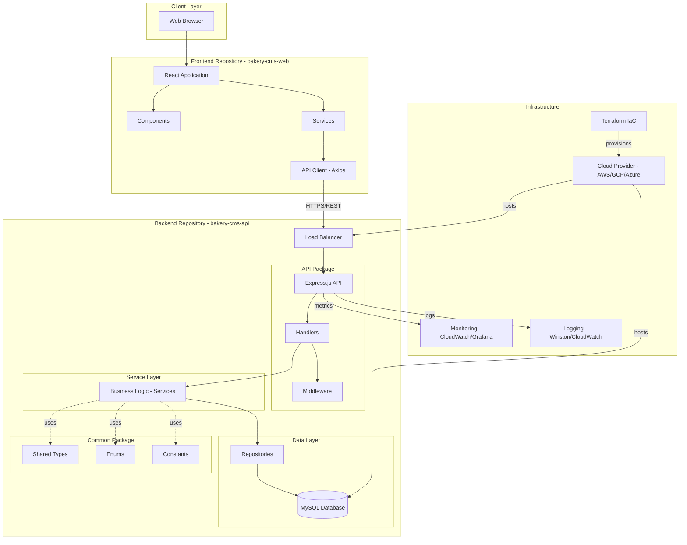
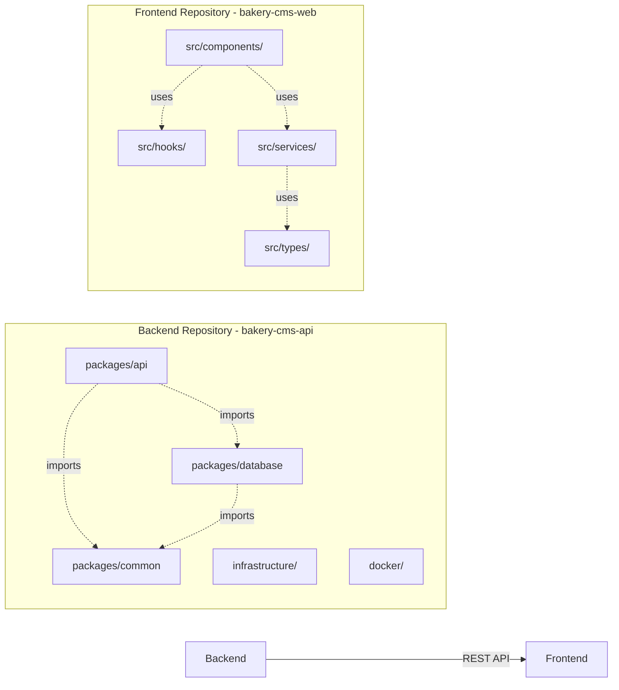
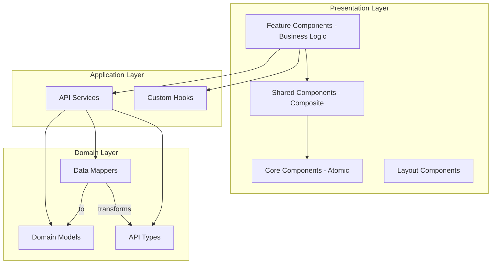
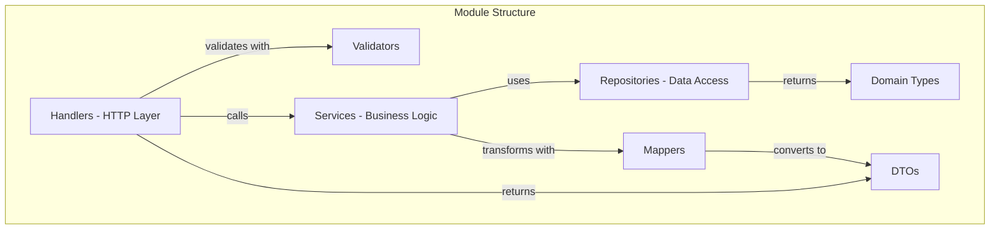
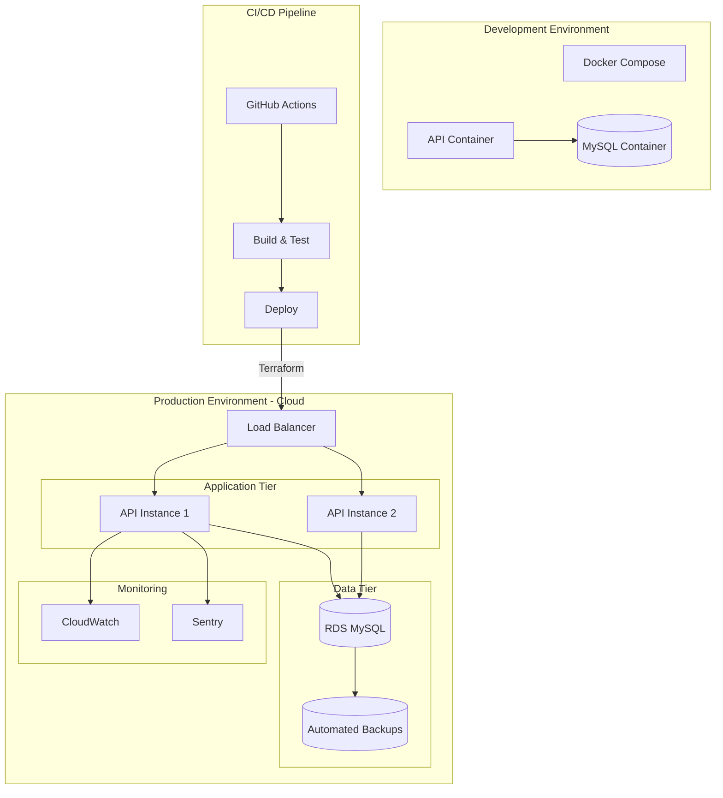
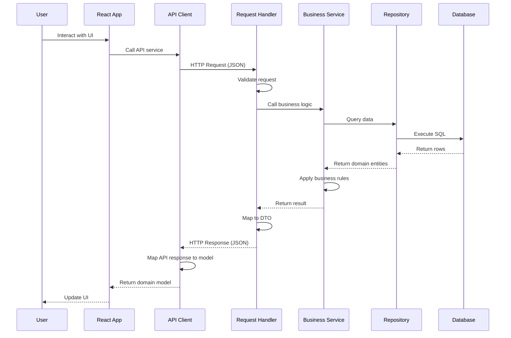
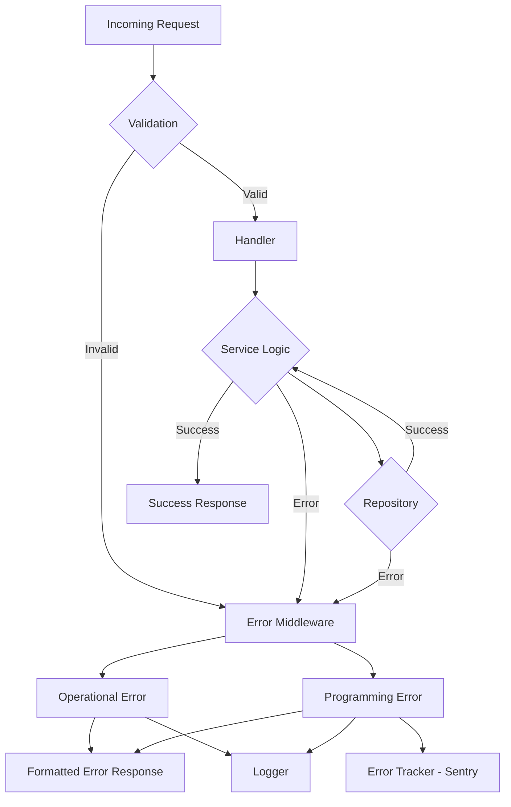

# Feature Specification: Base Infrastructure Setup

**Feature Branch**: `001-base-infrastructure-setup`  
**Created**: December 16, 2025  
**Status**: Draft  
**Input**: "setup base code and infrastructure include backend and frontend repo for bakery shop"

---

## Business Information

### Business Domain
**E-commerce / Point of Sale** - Cookie Sales Management for small businesses and freelancers

### Core Business Objectives
- Provide a scalable, maintainable foundation for cookie sales management
- Enable rapid feature development through well-structured codebase
- Support two business models: Made-to-Order and Ready-to-Sell cookies
- Ensure code quality, security, and performance from day one

### Target Users
- Freelancers selling homemade cookies
- Small cookie shop owners
- Online cookie sellers (social media, chat-based selling)
- Development team maintaining the application

### Business Value
- Reduced time-to-market for new features
- Lower maintenance costs through standardized architecture
- Improved reliability and security
- Better developer experience and productivity
- Foundation for future scalability

### Success Metrics
- Both repositories successfully created with proper structure
- All build processes working (lint, type-check, build, test)
- CI/CD pipelines operational
- Development environment setup time < 15 minutes
- Zero critical security vulnerabilities in dependencies

---

## Business Rules

### BR-001: Repository Separation
- **Condition**: All development work on this project
- **Action**: Backend and Frontend MUST be maintained in separate Git repositories
- **Priority**: Critical
- **Rationale**: Independent deployment cycles, clear separation of concerns
- **Exceptions**: None

### BR-002: Functional Programming Paradigm
- **Condition**: All code written for this project (Backend & Frontend)
- **Action**: MUST follow functional programming principles (pure functions, immutability, composition)
- **Priority**: Critical
- **Rationale**: Constitution mandate for maintainability and testability
- **Exceptions**: None

### BR-003: TypeScript-First Development
- **Condition**: All JavaScript code
- **Action**: MUST be written in TypeScript with strict mode enabled
- **Priority**: Critical
- **Rationale**: Type safety reduces runtime errors and improves code quality
- **Exceptions**: Configuration files (JavaScript allowed)

### BR-004: Yarn Package Management
- **Condition**: All dependency management
- **Action**: MUST use Yarn (Berry/v3+) as the package manager
- **Priority**: Critical
- **Rationale**: Deterministic dependency resolution, better performance
- **Exceptions**: None

### BR-005: Monorepo Structure (Backend Only)
- **Condition**: Backend repository organization
- **Action**: MUST follow monorepo structure with packages: api, common, database
- **Priority**: Critical
- **Rationale**: Code sharing, consistent versioning, simplified dependency management
- **Exceptions**: None

### BR-006: Infrastructure as Code
- **Condition**: All infrastructure setup
- **Action**: MUST be defined using Terraform
- **Priority**: High
- **Rationale**: Reproducible, version-controlled infrastructure
- **Exceptions**: Local development environment (Docker Compose allowed)

### BR-007: Automated Quality Checks
- **Condition**: Every code commit
- **Action**: MUST pass linting, type-checking, and testing
- **Priority**: High
- **Rationale**: Maintain code quality standards consistently
- **Exceptions**: None

### BR-008: Security-First Configuration
- **Condition**: All application configuration
- **Action**: Secrets MUST NOT be committed to version control; environment variables only
- **Priority**: Critical
- **Rationale**: Prevent security breaches and credential leaks
- **Exceptions**: None

---

## Data Type Setup

### Backend Enums

```typescript
// packages/common/src/enums/order.enums.ts
export enum OrderStatus {
  DRAFT = 'draft',
  CONFIRMED = 'confirmed',
  PAID = 'paid',
  CANCELLED = 'cancelled',
}

export enum OrderType {
  TEMPORARY = 'temporary',
  OFFICIAL = 'official',
}

// packages/common/src/enums/product.enums.ts
export enum BusinessType {
  MADE_TO_ORDER = 'made-to-order',
  READY_TO_SELL = 'ready-to-sell',
  BOTH = 'both',
}

export enum ProductStatus {
  AVAILABLE = 'available',
  OUT_OF_STOCK = 'out-of-stock',
}

// packages/common/src/enums/payment.enums.ts
export enum PaymentMethod {
  VIETQR = 'vietqr',
  CASH = 'cash',
  BANK_TRANSFER = 'bank-transfer',
}

export enum PaymentStatus {
  PENDING = 'pending',
  PAID = 'paid',
  FAILED = 'failed',
  REFUNDED = 'refunded',
}
```

### Backend Constants

```typescript
// packages/common/src/constants/config.constants.ts
export const CONFIG = {
  MAX_ORDER_ITEMS: 100,
  MIN_ORDER_AMOUNT: 1000,
  DEFAULT_PAGE_SIZE: 20,
  MAX_PAGE_SIZE: 100,
  SESSION_TIMEOUT: 3600,
  JWT_EXPIRY: 86400, // 24 hours
} as const;

// packages/common/src/constants/http.constants.ts
export const HTTP_STATUS = {
  OK: 200,
  CREATED: 201,
  BAD_REQUEST: 400,
  UNAUTHORIZED: 401,
  FORBIDDEN: 403,
  NOT_FOUND: 404,
  INTERNAL_ERROR: 500,
} as const;

// packages/common/src/constants/api.constants.ts
export const API_ROUTES = {
  HEALTH: '/health',
  READY: '/ready',
  ORDERS: '/api/v1/orders',
  PRODUCTS: '/api/v1/products',
  PAYMENTS: '/api/v1/payments',
  STATISTICS: '/api/v1/statistics',
} as const;

// packages/common/src/constants/error.constants.ts
export const ERROR_MESSAGES = {
  INVALID_ORDER: 'Invalid order data provided',
  PRODUCT_NOT_FOUND: 'Product not found',
  INSUFFICIENT_STOCK: 'Insufficient stock available',
  PAYMENT_FAILED: 'Payment processing failed',
  UNAUTHORIZED: 'Unauthorized access',
  VALIDATION_ERROR: 'Validation error occurred',
} as const;
```

### Backend Types

```typescript
// packages/common/src/types/common.types.ts
export type Result<T, E = AppError> =
  | { success: true; data: T }
  | { success: false; error: E };

export type Pagination = {
  page: number;
  pageSize: number;
  total: number;
  totalPages: number;
};

export type PaginatedResponse<T> = {
  data: T[];
  pagination: Pagination;
};

// packages/common/src/types/error.types.ts
export type ErrorCode =
  | 'VALIDATION_ERROR'
  | 'NOT_FOUND'
  | 'UNAUTHORIZED'
  | 'FORBIDDEN'
  | 'INTERNAL_ERROR';

export type AppError = {
  code: ErrorCode;
  statusCode: number;
  message: string;
  isOperational: boolean;
  details?: unknown;
};

// packages/common/src/types/database.types.ts
export type Timestamps = {
  createdAt: Date;
  updatedAt: Date;
};

export type SoftDelete = {
  deletedAt: Date | null;
};

export type BaseEntity = {
  id: string;
} & Timestamps;
```

### Frontend Types

```typescript
// src/types/api/common.api.ts
export type APIResponse<T> = {
  status: 'success' | 'error';
  data?: T;
  error?: {
    code: string;
    message: string;
    details?: unknown;
  };
};

export type PaginatedAPIResponse<T> = APIResponse<{
  items: T[];
  pagination: {
    page: number;
    page_size: number;
    total: number;
    total_pages: number;
  };
}>;

// src/types/models/common.model.ts
export type Result<T> =
  | { success: true; data: T }
  | { success: false; error: AppError };

export type AppError = {
  code: string;
  message: string;
  details?: unknown;
};

export type Pagination = {
  page: number;
  pageSize: number;
  total: number;
  totalPages: number;
};

export type PaginatedData<T> = {
  items: T[];
  pagination: Pagination;
};
```

---

## Code Structure Setup

### Backend Repository Structure (bakery-cms-api)

```
bakery-cms-api/
├── .github/
│   └── workflows/
│       ├── ci.yml                    # CI pipeline
│       └── cd.yml                    # CD pipeline
├── .yarn/                            # Yarn Berry files
├── packages/
│   ├── api/                          # Express.js API server
│   │   ├── src/
│   │   │   ├── modules/
│   │   │   │   ├── health/
│   │   │   │   │   ├── handlers/
│   │   │   │   │   │   └── health.handler.ts
│   │   │   │   │   └── index.ts
│   │   │   │   └── index.ts
│   │   │   ├── shared/
│   │   │   │   ├── middleware/
│   │   │   │   │   ├── error.middleware.ts
│   │   │   │   │   ├── logger.middleware.ts
│   │   │   │   │   ├── validation.middleware.ts
│   │   │   │   │   └── index.ts
│   │   │   │   ├── utils/
│   │   │   │   │   ├── logger.util.ts
│   │   │   │   │   ├── response.util.ts
│   │   │   │   │   └── index.ts
│   │   │   │   └── index.ts
│   │   │   ├── config/
│   │   │   │   ├── database.config.ts
│   │   │   │   ├── app.config.ts
│   │   │   │   └── index.ts
│   │   │   ├── app.ts                # Express app setup
│   │   │   └── server.ts             # Server entry point
│   │   ├── tests/
│   │   │   ├── integration/
│   │   │   └── setup.ts
│   │   ├── package.json
│   │   ├── tsconfig.json
│   │   └── jest.config.js
│   │
│   ├── common/                       # Shared types, constants, enums
│   │   ├── src/
│   │   │   ├── constants/
│   │   │   │   ├── config.constants.ts
│   │   │   │   ├── http.constants.ts
│   │   │   │   ├── api.constants.ts
│   │   │   │   ├── error.constants.ts
│   │   │   │   └── index.ts
│   │   │   ├── enums/
│   │   │   │   ├── order.enums.ts
│   │   │   │   ├── product.enums.ts
│   │   │   │   ├── payment.enums.ts
│   │   │   │   └── index.ts
│   │   │   ├── types/
│   │   │   │   ├── common.types.ts
│   │   │   │   ├── error.types.ts
│   │   │   │   ├── database.types.ts
│   │   │   │   └── index.ts
│   │   │   └── index.ts
│   │   ├── package.json
│   │   └── tsconfig.json
│   │
│   └── database/                     # Database models and migrations
│       ├── src/
│       │   ├── models/
│       │   │   └── index.ts
│       │   ├── migrations/
│       │   ├── seeders/
│       │   ├── config/
│       │   │   └── database.config.ts
│       │   └── index.ts
│       ├── package.json
│       ├── tsconfig.json
│       └── .sequelizerc
│
├── infrastructure/                   # Terraform IaC
│   ├── environments/
│   │   ├── dev/
│   │   │   ├── main.tf
│   │   │   ├── variables.tf
│   │   │   └── terraform.tfvars
│   │   ├── staging/
│   │   └── production/
│   ├── modules/
│   │   ├── database/
│   │   ├── api/
│   │   └── networking/
│   └── README.md
│
├── docker/
│   ├── Dockerfile.api
│   ├── Dockerfile.dev
│   └── docker-compose.yml           # Local development
│
├── .gitignore
├── .eslintrc.js
├── .prettierrc
├── package.json                      # Root package.json (workspaces)
├── tsconfig.json                     # Root TypeScript config
├── yarn.lock
├── .yarnrc.yml                       # Yarn Berry config
├── README.md
├── LICENSE
└── .env.example
```

### Frontend Repository Structure (bakery-cms-web)

```
bakery-cms-web/
├── .github/
│   └── workflows/
│       ├── ci.yml
│       └── cd.yml
├── public/
│   ├── index.html
│   ├── favicon.ico
│   └── assets/
├── src/
│   ├── components/
│   │   ├── core/                     # Atomic UI components
│   │   │   ├── Button/
│   │   │   │   ├── Button.tsx
│   │   │   │   ├── Button.types.ts
│   │   │   │   ├── Button.module.css
│   │   │   │   ├── Button.test.tsx
│   │   │   │   └── index.ts
│   │   │   ├── Input/
│   │   │   ├── Card/
│   │   │   ├── Modal/
│   │   │   ├── Spinner/
│   │   │   ├── ErrorMessage/
│   │   │   └── index.ts
│   │   │
│   │   ├── shared/                   # Composite components
│   │   │   └── index.ts
│   │   │
│   │   ├── features/                 # Feature-specific components
│   │   │   └── index.ts
│   │   │
│   │   └── layouts/                  # Layout components
│   │       ├── MainLayout/
│   │       │   ├── MainLayout.tsx
│   │       │   ├── MainLayout.types.ts
│   │       │   ├── MainLayout.module.css
│   │       │   └── index.ts
│   │       └── index.ts
│   │
│   ├── pages/
│   │   ├── HomePage/
│   │   │   ├── HomePage.tsx
│   │   │   ├── HomePage.test.tsx
│   │   │   └── index.ts
│   │   └── index.ts
│   │
│   ├── hooks/
│   │   ├── useAPI.ts
│   │   ├── useDebounce.ts
│   │   └── index.ts
│   │
│   ├── services/
│   │   ├── api/
│   │   │   ├── client.ts             # Axios configuration
│   │   │   ├── interceptors.ts
│   │   │   └── index.ts
│   │   └── index.ts
│   │
│   ├── types/
│   │   ├── api/
│   │   │   ├── common.api.ts
│   │   │   └── index.ts
│   │   ├── models/
│   │   │   ├── common.model.ts
│   │   │   └── index.ts
│   │   └── mappers/
│   │       └── index.ts
│   │
│   ├── utils/
│   │   ├── validation.util.ts
│   │   ├── format.util.ts
│   │   └── index.ts
│   │
│   ├── config/
│   │   ├── app.config.ts
│   │   └── index.ts
│   │
│   ├── styles/
│   │   ├── global.css
│   │   ├── variables.css
│   │   └── reset.css
│   │
│   ├── App.tsx
│   ├── App.test.tsx
│   ├── index.tsx
│   └── react-app-env.d.ts
│
├── .gitignore
├── .eslintrc.js
├── .prettierrc
├── package.json
├── tsconfig.json
├── yarn.lock
├── .env.example
├── README.md
└── LICENSE
```

### Layer Responsibilities

#### Backend Layers

**1. Presentation Layer (Handlers/Middleware)**
- HTTP request/response handling
- Input validation and sanitization
- Request logging
- Error formatting
- Authentication/authorization checks

**2. Application Layer (Services)**
- Business logic implementation
- Transaction management
- Service composition
- Event handling
- External service integration

**3. Domain Layer (Types/Entities/DTOs)**
- Domain models and types
- Business rules validation
- Data transfer objects
- Value objects
- Enums and constants

**4. Infrastructure Layer (Repositories/Database)**
- Data persistence
- Database queries
- External API calls
- File storage operations
- Cache management

#### Frontend Layers

**1. Presentation Layer (Components)**
- **Core Components**: Reusable atomic UI elements
- **Shared Components**: Composite components
- **Feature Components**: Business logic and data fetching
- **Layout Components**: Page structure and navigation

**2. Application Layer (Services/Hooks)**
- API communication
- State management
- Custom React hooks
- Business logic utilities

**3. Domain Layer (Types/Models)**
- Domain models
- API response types
- Validation schemas
- Mappers for data transformation

---

## Infrastructure Setup

### Database Configuration

#### Database Type
- **RDBMS**: MySQL 8.0+
- **Reason**: ACID compliance, strong data integrity, mature ecosystem

#### Connection Configuration
```typescript
// packages/database/src/config/database.config.ts
export const databaseConfig = {
  development: {
    dialect: 'mysql',
    host: process.env.DB_HOST || 'localhost',
    port: parseInt(process.env.DB_PORT || '3306', 10),
    database: process.env.DB_NAME || 'bakery_cms_dev',
    username: process.env.DB_USER || 'root',
    password: process.env.DB_PASSWORD || '',
    pool: {
      max: 10,
      min: 2,
      acquire: 30000,
      idle: 10000,
    },
    logging: console.log,
  },
  production: {
    dialect: 'mysql',
    host: process.env.DB_HOST!,
    port: parseInt(process.env.DB_PORT || '3306', 10),
    database: process.env.DB_NAME!,
    username: process.env.DB_USER!,
    password: process.env.DB_PASSWORD!,
    pool: {
      max: 20,
      min: 5,
      acquire: 60000,
      idle: 10000,
    },
    logging: false,
  },
};
```

#### Migrations Strategy
- Sequelize CLI for migration management
- All schema changes through migrations (no direct DB modifications)
- Migration naming: `YYYYMMDDHHMMSS-description.ts`
- Rollback capability required for all migrations

#### Backup Strategy
- Automated daily backups (production)
- Point-in-time recovery enabled
- Backup retention: 30 days
- Test restore procedure monthly

### Development Environment

#### Docker Compose Configuration
```yaml
# docker/docker-compose.yml
version: '3.8'

services:
  mysql:
    image: mysql:8.0
    container_name: bakery-mysql
    restart: unless-stopped
    environment:
      MYSQL_ROOT_PASSWORD: ${DB_PASSWORD:-root}
      MYSQL_DATABASE: ${DB_NAME:-bakery_cms_dev}
    ports:
      - "3306:3306"
    volumes:
      - mysql_data:/var/lib/mysql
    networks:
      - bakery-network

  api:
    build:
      context: .
      dockerfile: docker/Dockerfile.dev
    container_name: bakery-api
    restart: unless-stopped
    environment:
      NODE_ENV: development
      DB_HOST: mysql
      DB_PORT: 3306
      DB_NAME: ${DB_NAME:-bakery_cms_dev}
      DB_USER: root
      DB_PASSWORD: ${DB_PASSWORD:-root}
    ports:
      - "3000:3000"
    volumes:
      - ./packages:/app/packages
      - /app/node_modules
    depends_on:
      - mysql
    networks:
      - bakery-network
    command: yarn workspace @bakery/api dev

volumes:
  mysql_data:

networks:
  bakery-network:
    driver: bridge
```

### CI/CD Pipeline

#### Backend CI Pipeline (.github/workflows/ci.yml)
```yaml
name: Backend CI

on:
  pull_request:
    branches: [main, develop]
  push:
    branches: [main, develop]

jobs:
  lint-and-test:
    runs-on: ubuntu-latest
    
    services:
      mysql:
        image: mysql:8.0
        env:
          MYSQL_ROOT_PASSWORD: test
          MYSQL_DATABASE: bakery_cms_test
        ports:
          - 3306:3306
        options: >-
          --health-cmd="mysqladmin ping"
          --health-interval=10s
          --health-timeout=5s
          --health-retries=3

    steps:
      - uses: actions/checkout@v3
      
      - name: Setup Node.js
        uses: actions/setup-node@v3
        with:
          node-version: '18'
          cache: 'yarn'
      
      - name: Enable Corepack
        run: corepack enable
      
      - name: Install dependencies
        run: yarn install --immutable
      
      - name: Lint
        run: yarn lint
      
      - name: Type check
        run: yarn type-check
      
      - name: Run tests
        run: yarn test
        env:
          DB_HOST: localhost
          DB_PORT: 3306
          DB_NAME: bakery_cms_test
          DB_USER: root
          DB_PASSWORD: test
      
      - name: Build
        run: yarn build
      
      - name: Upload coverage
        uses: codecov/codecov-action@v3
        with:
          files: ./coverage/lcov.info
```

#### Frontend CI Pipeline (.github/workflows/ci.yml)
```yaml
name: Frontend CI

on:
  pull_request:
    branches: [main, develop]
  push:
    branches: [main, develop]

jobs:
  lint-and-test:
    runs-on: ubuntu-latest

    steps:
      - uses: actions/checkout@v3
      
      - name: Setup Node.js
        uses: actions/setup-node@v3
        with:
          node-version: '18'
          cache: 'yarn'
      
      - name: Enable Corepack
        run: corepack enable
      
      - name: Install dependencies
        run: yarn install --immutable
      
      - name: Lint
        run: yarn lint
      
      - name: Type check
        run: yarn type-check
      
      - name: Run tests
        run: yarn test --coverage
      
      - name: Build
        run: yarn build
      
      - name: Upload coverage
        uses: codecov/codecov-action@v3
        with:
          files: ./coverage/lcov.info
```

### Security Configuration

#### Authentication
- **Method**: JWT (JSON Web Tokens)
- **Token Storage**: httpOnly cookies (production), localStorage (development)
- **Token Expiry**: 24 hours (access token), 7 days (refresh token)
- **Password Hashing**: bcrypt with 10 rounds minimum

#### Authorization
- **Strategy**: Role-Based Access Control (RBAC)
- **Roles**: Admin, Seller, Viewer (future expansion)
- **Implementation**: Middleware-based permission checks

#### Security Headers (Backend)
```typescript
// Helmet configuration
helmet({
  contentSecurityPolicy: {
    directives: {
      defaultSrc: ["'self'"],
      styleSrc: ["'self'", "'unsafe-inline'"],
      scriptSrc: ["'self'"],
      imgSrc: ["'self'", "data:", "https:"],
    },
  },
  hsts: {
    maxAge: 31536000,
    includeSubDomains: true,
  },
})
```

#### Rate Limiting
```typescript
// Rate limiting configuration
const rateLimiter = rateLimit({
  windowMs: 15 * 60 * 1000, // 15 minutes
  max: 100, // Limit each IP to 100 requests per windowMs
  message: 'Too many requests from this IP',
  standardHeaders: true,
  legacyHeaders: false,
});
```

#### CORS Configuration
```typescript
// CORS configuration
const corsOptions = {
  origin: process.env.ALLOWED_ORIGINS?.split(',') || ['http://localhost:3001'],
  credentials: true,
  optionsSuccessStatus: 200,
};
```

### Monitoring & Logging

#### Logging Strategy
- **Library**: Winston
- **Format**: JSON (production), Pretty (development)
- **Levels**: error, warn, info, http, debug
- **Transport**: Console (dev), CloudWatch (production)

```typescript
// Winston configuration
const logger = winston.createLogger({
  level: process.env.LOG_LEVEL || 'info',
  format: winston.format.combine(
    winston.format.timestamp(),
    winston.format.errors({ stack: true }),
    winston.format.json()
  ),
  transports: [
    new winston.transports.Console({
      format: winston.format.combine(
        winston.format.colorize(),
        winston.format.simple()
      ),
    }),
  ],
});
```

#### Health Check Endpoints
```typescript
// GET /health - Basic health check
{
  "status": "ok",
  "timestamp": "2025-12-16T10:00:00.000Z",
  "uptime": 12345
}

// GET /ready - Readiness check (includes dependencies)
{
  "status": "ready",
  "database": "connected",
  "timestamp": "2025-12-16T10:00:00.000Z"
}
```

#### Metrics Collection
- Request count by endpoint
- Response time percentiles (p50, p95, p99)
- Error rate by type
- Database query performance
- Active connections

### Error Tracking
- **Service**: Sentry (production) / Console (development)
- **Error Types Tracked**: Application errors, validation errors, database errors, external service failures
- **Alert Triggers**: Error rate > 1%, response time > 1s, critical errors

---

## Diagrams

### System Architecture Diagram



### Repository Structure Diagram



### Component Architecture Diagram (Frontend)



### Backend Module Architecture Diagram



### Deployment Diagram



### Data Flow Diagram



### Error Handling Flow



---

## Research & Technology Decisions

### Technology Choice: Package Manager - Yarn Berry

**Purpose**: Dependency management for both backend and frontend repositories

**Options Considered**:
1. **npm** 
   - Pros: Default package manager, widely used, good documentation
   - Cons: Slower than alternatives, less deterministic, larger node_modules

2. **pnpm**
   - Pros: Fast, space-efficient, strict dependency resolution
   - Cons: Smaller ecosystem, some packages may have compatibility issues

3. **Yarn Berry (v3+)**
   - Pros: Plug'n'Play (PnP) for faster installs, zero-installs capability, deterministic, excellent monorepo support
   - Cons: Learning curve, some legacy packages may need adjustments

**Selected**: Yarn Berry (v3+)

**Justification**: 
- Constitution mandates Yarn usage
- PnP mode provides significant performance improvements
- Excellent monorepo support (critical for backend)
- Zero-installs capability for faster CI/CD
- Deterministic dependency resolution prevents "works on my machine" issues

**Trade-offs**:
- Slightly higher initial setup complexity
- May need compatibility workarounds for some legacy packages

**References**:
- https://yarnpkg.com/getting-started
- https://yarnpkg.com/features/pnp
- https://yarnpkg.com/features/zero-installs

---

### Technology Choice: Backend Framework - Express.js

**Purpose**: HTTP server framework for REST API

**Options Considered**:
1. **NestJS**
   - Pros: Built-in TypeScript support, decorators, dependency injection, scalable architecture
   - Cons: Heavier framework, more opinionated, steeper learning curve

2. **Fastify**
   - Pros: Very fast, schema-based validation, TypeScript support
   - Cons: Smaller ecosystem, fewer middleware options

3. **Express.js**
   - Pros: Mature ecosystem, flexible, large community, abundant middleware
   - Cons: Requires more setup for TypeScript, less structured by default

**Selected**: Express.js

**Justification**:
- Proposal document suggests Express.js
- More flexibility to implement functional programming patterns
- Mature ecosystem with extensive middleware options
- Team familiarity and abundant resources
- Can be structured to follow constitution principles

**Trade-offs**:
- Less built-in structure (requires discipline to maintain architecture)
- More manual TypeScript setup needed

**References**:
- https://expressjs.com/
- https://github.com/expressjs/express

---

### Technology Choice: ORM - Sequelize

**Purpose**: Object-Relational Mapping for MySQL database

**Options Considered**:
1. **TypeORM**
   - Pros: TypeScript-first, decorators, Active Record and Data Mapper patterns
   - Cons: Less mature for MySQL, some TypeScript issues

2. **Prisma**
   - Pros: Modern, excellent TypeScript support, type-safe queries, schema migration
   - Cons: Query builder approach may conflict with functional patterns

3. **Sequelize**
   - Pros: Mature, excellent MySQL support, flexible, migrations built-in
   - Cons: TypeScript support requires additional setup

**Selected**: Sequelize

**Justification**:
- Constitution mandates Sequelize
- Mature and stable with excellent MySQL support
- Built-in migration system
- Can be used functionally (repository pattern)
- Large community and extensive documentation

**Trade-offs**:
- TypeScript typings require careful setup
- Less modern API compared to newer ORMs

**References**:
- https://sequelize.org/
- https://sequelize.org/docs/v6/getting-started/

---

### Technology Choice: Frontend Framework - React.js

**Purpose**: User interface framework

**Options Considered**:
1. **Vue.js**
   - Pros: Simpler learning curve, reactive system, good documentation
   - Cons: Smaller ecosystem compared to React

2. **Angular**
   - Pros: Full-featured framework, TypeScript native
   - Cons: Heavy, more complex, less flexible

3. **React.js**
   - Pros: Large ecosystem, functional components, hooks, excellent TypeScript support
   - Cons: Requires additional libraries for routing, state management

**Selected**: React.js with TypeScript

**Justification**:
- Proposal document suggests React
- Constitution emphasizes functional programming (React hooks align perfectly)
- Excellent TypeScript support
- Large ecosystem of libraries and tools
- Functional components match constitution principles

**Trade-offs**:
- Need to choose and integrate additional libraries (routing, state management)
- Potential for inconsistent patterns without strict guidelines

**References**:
- https://react.dev/
- https://react-typescript-cheatsheet.netlify.app/

---

### Technology Choice: HTTP Client - Axios

**Purpose**: HTTP client for API communication in frontend

**Options Considered**:
1. **Fetch API**
   - Pros: Native, no dependencies, modern
   - Cons: Less features, requires more boilerplate for interceptors

2. **Axios**
   - Pros: Interceptors, request/response transformation, automatic JSON handling
   - Cons: Additional dependency

3. **TanStack Query (React Query)**
   - Pros: Caching, background updates, built-in state management
   - Cons: Different paradigm, may be overkill for simple use cases

**Selected**: Axios

**Justification**:
- Constitution mandates Axios for base configuration
- Interceptors perfect for auth token handling
- Easy request/response transformation (API → Domain model)
- Familiar API and extensive documentation
- Can be wrapped in functional utilities

**Trade-offs**:
- Additional dependency (not native)
- No built-in caching (can add later if needed)

**References**:
- https://axios-http.com/
- https://github.com/axios/axios

---

### Technology Choice: Infrastructure as Code - Terraform

**Purpose**: Infrastructure provisioning and management

**Options Considered**:
1. **AWS CloudFormation**
   - Pros: Native AWS support, good integration
   - Cons: AWS-only, verbose YAML/JSON syntax

2. **Pulumi**
   - Pros: Use programming languages (TypeScript), type-safe
   - Cons: Newer, smaller community

3. **Terraform**
   - Pros: Multi-cloud, mature, large community, HCL is readable
   - Cons: State management complexity

**Selected**: Terraform

**Justification**:
- Constitution mandates Terraform
- Multi-cloud support (not locked to single provider)
- Mature and industry-standard
- Extensive provider ecosystem
- HCL is declarative and readable

**Trade-offs**:
- State file management requires discipline
- Not as type-safe as code-based solutions

**References**:
- https://www.terraform.io/
- https://registry.terraform.io/

---

### Technology Choice: Testing Framework - Jest

**Purpose**: Unit and integration testing for both backend and frontend

**Options Considered**:
1. **Mocha + Chai**
   - Pros: Flexible, mature, good community
   - Cons: Requires multiple packages, more configuration

2. **Vitest**
   - Pros: Very fast, Vite-native, modern
   - Cons: Newer, smaller ecosystem

3. **Jest**
   - Pros: All-in-one solution, great TypeScript support, snapshot testing, coverage built-in
   - Cons: Slower than some alternatives

**Selected**: Jest

**Justification**:
- All-in-one testing solution (test runner, assertions, mocking, coverage)
- Excellent TypeScript support
- Works great with React (React Testing Library)
- Industry standard with extensive documentation
- Constitution requires 80% coverage (Jest has built-in coverage)

**Trade-offs**:
- Can be slower than newer alternatives
- Configuration can be complex for advanced use cases

**References**:
- https://jestjs.io/
- https://testing-library.com/docs/react-testing-library/intro/

---

### Technology Choice: Code Quality Tools - ESLint + Prettier

**Purpose**: Linting and code formatting

**Options Considered**:
1. **ESLint only**
   - Pros: Powerful linting rules
   - Cons: Formatting rules can conflict with Prettier

2. **Prettier only**
   - Pros: Opinionated formatting, no configuration needed
   - Cons: No linting capabilities

3. **ESLint + Prettier**
   - Pros: Best of both worlds, ESLint for linting, Prettier for formatting
   - Cons: Need to configure them to work together

**Selected**: ESLint + Prettier

**Justification**:
- ESLint catches code quality issues (unused variables, type errors, etc.)
- Prettier ensures consistent formatting
- Together they enforce constitution standards
- Industry-standard combination
- Integrates well with TypeScript

**Configuration**:
```json
// .eslintrc.js
module.exports = {
  extends: [
    'eslint:recommended',
    'plugin:@typescript-eslint/recommended',
    'plugin:@typescript-eslint/recommended-requiring-type-checking',
    'prettier'
  ],
  rules: {
    '@typescript-eslint/no-explicit-any': 'error',
    '@typescript-eslint/explicit-function-return-type': 'warn',
    '@typescript-eslint/no-unused-vars': 'error',
  }
};
```

**Trade-offs**:
- Requires proper configuration to avoid conflicts
- Build time slightly longer with linting

**References**:
- https://eslint.org/
- https://prettier.io/
- https://github.com/prettier/eslint-config-prettier

---

### Business Solution: Monorepo vs Multi-repo for Backend

**Problem**: How to organize backend code for optimal code sharing and maintainability

**Proposed Solution**: Monorepo structure with Yarn Workspaces

**Structure**:
```
packages/
├── api/       # Express.js application
├── common/    # Shared types, constants, enums
└── database/  # Database models and migrations
```

**Alternatives Considered**:
1. **Multi-repo** (separate repos for api, common, database)
   - Pros: True independence, separate versioning
   - Cons: Code sharing difficult, version synchronization issues, harder to refactor across packages

2. **Single package** (everything in one package)
   - Pros: Simplest setup
   - Cons: Poor separation of concerns, tight coupling, harder to test in isolation

**Expected Impact**:
- Faster development with shared code
- Consistent versioning across packages
- Easier refactoring across boundaries
- Better code organization and separation of concerns

**Risk Assessment**:
- Learning curve for developers unfamiliar with monorepos
- Build complexity increases slightly
- Need proper tooling setup

**Mitigation Strategy**:
- Clear documentation on monorepo structure
- Use Yarn Workspaces (simple and built-in)
- Establish clear package boundaries from the start
- Regular team training on monorepo practices

**References**:
- https://yarnpkg.com/features/workspaces
- https://monorepo.tools/

---

### Business Solution: Separate Repositories for Backend and Frontend

**Problem**: How to organize backend and frontend codebases

**Proposed Solution**: Two separate Git repositories

**Justification**:
- Constitution mandate (BR-001)
- Independent deployment cycles
- Different release schedules
- Clear separation of concerns
- Different team ownership possible
- Easier CI/CD configuration

**Repositories**:
1. **bakery-cms-api** - Backend monorepo
2. **bakery-cms-web** - Frontend application

**Expected Impact**:
- Faster deployment cycles
- Independent scaling of frontend and backend
- Clearer ownership boundaries
- Reduced merge conflicts

**Risk Assessment**:
- API contract synchronization between repos
- Need for API documentation
- Potential for versioning mismatches

**Mitigation Strategy**:
- OpenAPI/Swagger documentation for API contracts
- Versioned API endpoints (/api/v1/)
- Automated API contract testing
- Shared types documentation

---

## Development Setup Instructions

### Prerequisites
- Node.js 18+ (LTS recommended)
- Yarn Berry (will be configured via Corepack)
- Docker & Docker Compose (for local development)
- Git
- MySQL Client (optional, for direct DB access)

### Backend Repository Setup

#### 1. Initialize Repository
```bash
# Create repository directory
mkdir bakery-cms-api
cd bakery-cms-api

# Initialize Git
git init
git branch -M main

# Initialize Node.js project
npm init -y

# Enable Corepack for Yarn Berry
corepack enable
corepack prepare yarn@stable --activate

# Set Yarn version
yarn set version berry

# Initialize Yarn Berry
yarn init -w
```

#### 2. Configure Yarn Workspaces
```json
// package.json
{
  "name": "bakery-cms-api",
  "version": "1.0.0",
  "private": true,
  "workspaces": [
    "packages/*"
  ],
  "scripts": {
    "dev": "yarn workspace @bakery/api dev",
    "build": "yarn workspaces foreach -A run build",
    "test": "yarn workspaces foreach -A run test",
    "lint": "yarn workspaces foreach -A run lint",
    "type-check": "yarn workspaces foreach -A run type-check",
    "docker:up": "docker-compose -f docker/docker-compose.yml up -d",
    "docker:down": "docker-compose -f docker/docker-compose.yml down",
    "migration:generate": "yarn workspace @bakery/database migration:generate",
    "migration:run": "yarn workspace @bakery/database migration:run",
    "migration:revert": "yarn workspace @bakery/database migration:revert"
  },
  "packageManager": "yarn@4.0.2"
}
```

#### 3. Create Directory Structure
```bash
# Create workspace packages
mkdir -p packages/{api,common,database}/src
mkdir -p docker infrastructure/{environments/{dev,staging,production},modules}

# Create API structure
mkdir -p packages/api/src/{modules/health/handlers,shared/{middleware,utils},config}
mkdir -p packages/api/tests/integration

# Create common structure
mkdir -p packages/common/src/{constants,enums,types}

# Create database structure
mkdir -p packages/database/src/{models,migrations,seeders,config}
```

#### 4. Install Dependencies
```bash
# Install root dependencies
yarn add -D typescript @types/node ts-node nodemon
yarn add -D eslint @typescript-eslint/parser @typescript-eslint/eslint-plugin
yarn add -D prettier eslint-config-prettier eslint-plugin-prettier
yarn add -D jest @types/jest ts-jest

# Install API package dependencies
yarn workspace @bakery/api add express cors helmet compression morgan
yarn workspace @bakery/api add express-rate-limit express-validator
yarn workspace @bakery/api add -D @types/express @types/cors @types/morgan

# Install database package dependencies
yarn workspace @bakery/database add sequelize mysql2
yarn workspace @bakery/database add -D sequelize-cli @types/validator

# Install common package dependencies (none initially, just types)
```

#### 5. Configure TypeScript
```json
// tsconfig.json (root)
{
  "compilerOptions": {
    "target": "ES2022",
    "module": "commonjs",
    "lib": ["ES2022"],
    "outDir": "./dist",
    "rootDir": "./packages",
    "strict": true,
    "esModuleInterop": true,
    "skipLibCheck": true,
    "forceConsistentCasingInFileNames": true,
    "resolveJsonModule": true,
    "declaration": true,
    "declarationMap": true,
    "sourceMap": true,
    "composite": true,
    "noUnusedLocals": true,
    "noUnusedParameters": true,
    "noImplicitReturns": true,
    "noFallthroughCasesInSwitch": true
  },
  "exclude": ["node_modules", "dist", "**/*.test.ts"]
}
```

#### 6. Configure ESLint and Prettier
```javascript
// .eslintrc.js
module.exports = {
  root: true,
  parser: '@typescript-eslint/parser',
  parserOptions: {
    ecmaVersion: 2022,
    sourceType: 'module',
    project: './tsconfig.json',
  },
  extends: [
    'eslint:recommended',
    'plugin:@typescript-eslint/recommended',
    'plugin:@typescript-eslint/recommended-requiring-type-checking',
    'prettier',
  ],
  plugins: ['@typescript-eslint'],
  rules: {
    '@typescript-eslint/no-explicit-any': 'error',
    '@typescript-eslint/explicit-function-return-type': 'warn',
    '@typescript-eslint/no-unused-vars': ['error', { argsIgnorePattern: '^_' }],
    '@typescript-eslint/explicit-module-boundary-types': 'warn',
  },
  env: {
    node: true,
    es2022: true,
  },
};
```

```json
// .prettierrc
{
  "semi": true,
  "trailingComma": "es5",
  "singleQuote": true,
  "printWidth": 100,
  "tabWidth": 2,
  "arrowParens": "always"
}
```

#### 7. Create Environment Files
```bash
# .env.example
NODE_ENV=development
PORT=3000

# Database
DB_HOST=localhost
DB_PORT=3306
DB_NAME=bakery_cms_dev
DB_USER=root
DB_PASSWORD=root

# JWT
JWT_SECRET=your-secret-key-here
JWT_EXPIRY=86400

# CORS
ALLOWED_ORIGINS=http://localhost:3001

# Logging
LOG_LEVEL=info
```

### Frontend Repository Setup

#### 1. Initialize Repository
```bash
# Create repository directory
mkdir bakery-cms-web
cd bakery-cms-web

# Initialize with Create React App (TypeScript)
npx create-react-app . --template typescript

# Enable Corepack for Yarn Berry
corepack enable
corepack prepare yarn@stable --activate
yarn set version berry
```

#### 2. Create Directory Structure
```bash
mkdir -p src/{components/{core,shared,features,layouts},pages,hooks,services/api,types/{api,models,mappers},utils,config,styles}

# Create example component structure
mkdir -p src/components/core/Button
mkdir -p src/components/layouts/MainLayout
mkdir -p src/pages/HomePage
```

#### 3. Install Additional Dependencies
```bash
# HTTP client
yarn add axios

# Routing
yarn add react-router-dom
yarn add -D @types/react-router-dom

# Development tools
yarn add -D eslint-plugin-react eslint-plugin-react-hooks
```

#### 4. Configure TypeScript
```json
// tsconfig.json
{
  "compilerOptions": {
    "target": "ES2022",
    "lib": ["ES2022", "DOM", "DOM.Iterable"],
    "jsx": "react-jsx",
    "module": "esnext",
    "moduleResolution": "node",
    "resolveJsonModule": true,
    "allowJs": false,
    "strict": true,
    "esModuleInterop": true,
    "skipLibCheck": true,
    "forceConsistentCasingInFileNames": true,
    "noUnusedLocals": true,
    "noUnusedParameters": true,
    "noImplicitReturns": true,
    "noFallthroughCasesInSwitch": true,
    "isolatedModules": true,
    "allowSyntheticDefaultImports": true,
    "baseUrl": "src",
    "paths": {
      "@components/*": ["components/*"],
      "@pages/*": ["pages/*"],
      "@hooks/*": ["hooks/*"],
      "@services/*": ["services/*"],
      "@types/*": ["types/*"],
      "@utils/*": ["utils/*"],
      "@config/*": ["config/*"]
    }
  },
  "include": ["src"],
  "exclude": ["node_modules", "build"]
}
```

#### 5. Configure ESLint
```javascript
// .eslintrc.js
module.exports = {
  root: true,
  parser: '@typescript-eslint/parser',
  parserOptions: {
    ecmaVersion: 2022,
    sourceType: 'module',
    ecmaFeatures: {
      jsx: true,
    },
    project: './tsconfig.json',
  },
  extends: [
    'eslint:recommended',
    'plugin:@typescript-eslint/recommended',
    'plugin:@typescript-eslint/recommended-requiring-type-checking',
    'plugin:react/recommended',
    'plugin:react-hooks/recommended',
    'prettier',
  ],
  plugins: ['@typescript-eslint', 'react', 'react-hooks'],
  rules: {
    '@typescript-eslint/no-explicit-any': 'error',
    '@typescript-eslint/explicit-function-return-type': 'warn',
    'react/react-in-jsx-scope': 'off',
    'react/prop-types': 'off',
    '@typescript-eslint/no-unused-vars': ['error', { argsIgnorePattern: '^_' }],
  },
  settings: {
    react: {
      version: 'detect',
    },
  },
  env: {
    browser: true,
    es2022: true,
  },
};
```

#### 6. Create Environment Files
```bash
# .env.example
REACT_APP_API_URL=http://localhost:3000/api/v1
REACT_APP_ENV=development
```

---

## Quality Checklist

- [x] All backend sections included
- [x] All frontend sections included  
- [x] All diagrams created and accurate
- [x] Research section documents all technology choices
- [x] No redundant or unnecessary code
- [x] No plans or task breakdowns included
- [x] Follows constitution principles
- [x] Clear and actionable specifications
- [x] Linked to original requirements (proposal document)
- [x] Validated against business rules

---

## Validation Against Requirements

### From Proposal Document

✅ **Cookie Sales Management Application** - Foundation supports product management, orders, payments, statistics

✅ **Two Sales Models Support** - Enums and types defined for Made-to-Order and Ready-to-Sell

✅ **Scalable and Practical System** - Architecture designed for scalability with proper separation of concerns

✅ **Tech Stack Alignment** - React for frontend, Node.js (Express) for backend, MySQL database

✅ **VietQR Support** - Infrastructure allows for payment integration (PaymentMethod enum includes VIETQR)

✅ **Statistics & Reports** - Architecture supports data aggregation and reporting features

### From Constitution

✅ **Functional Programming** - All architecture follows functional paradigms

✅ **TypeScript-First** - Strict TypeScript configuration enforced

✅ **Monorepo (Backend)** - Packages structure: api, common, database

✅ **Separate Repositories** - Backend and frontend in separate repos

✅ **SOLID Principles** - Layered architecture supports all SOLID principles

✅ **Yarn Package Management** - Yarn Berry configured for both repos

✅ **Security Requirements** - JWT, RBAC, rate limiting, security headers configured

✅ **Testing Standards** - Jest configured with 80% coverage target

✅ **Infrastructure as Code** - Terraform structure included

---

## Next Steps

This specification provides the complete foundation for the Bakery CMS project. The next phase should involve:

1. **Plan Agent**: Break down this specification into actionable tasks
2. **Implement Agent**: Execute the tasks following this specification
3. **Review**: Validate implementation against this specification
4. **Documentation**: Update documentation as implementation progresses

---

**End of Specification**
