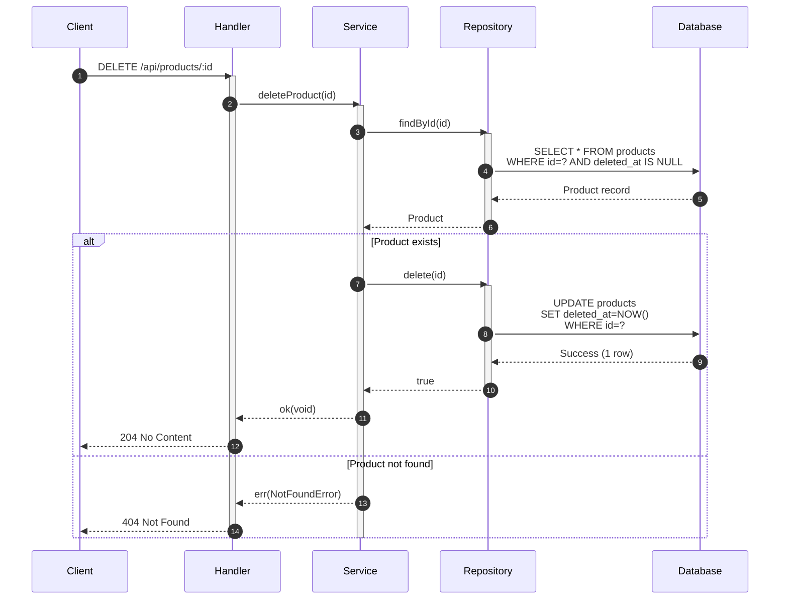
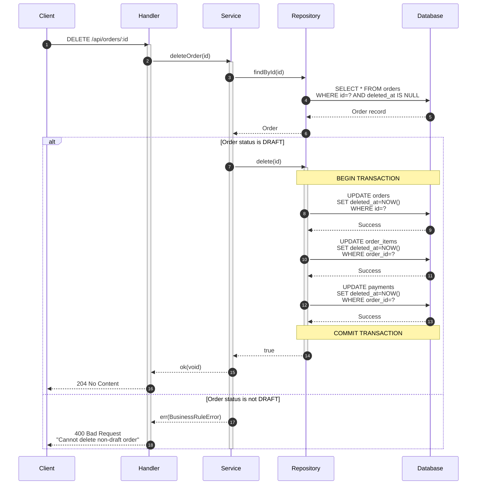
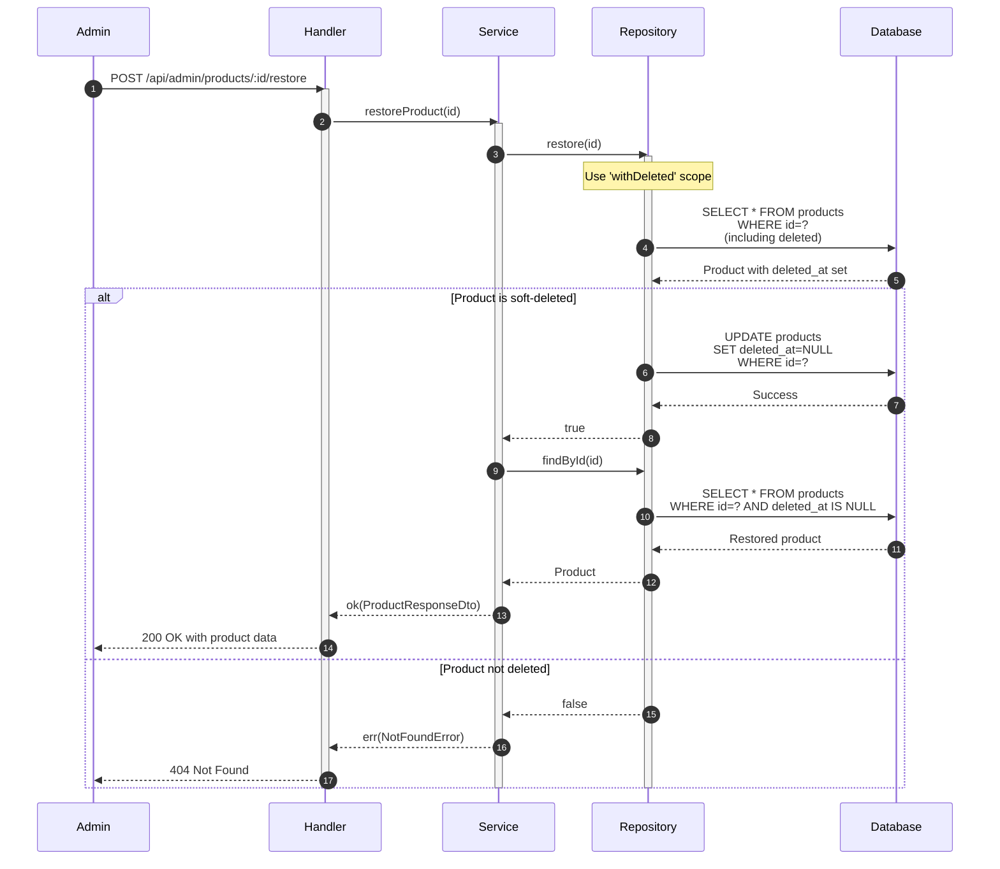
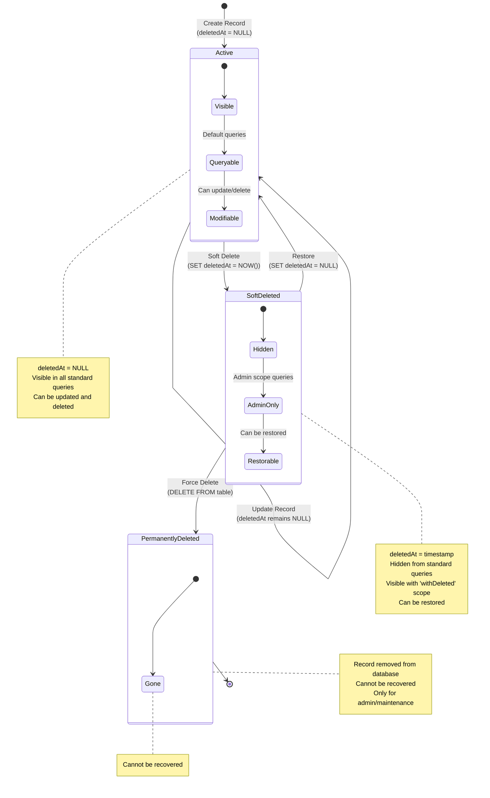
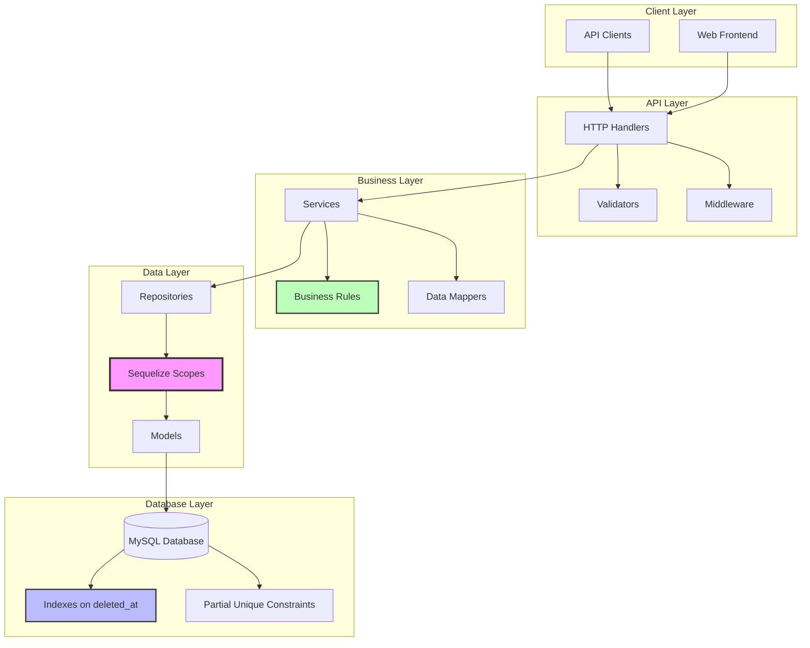
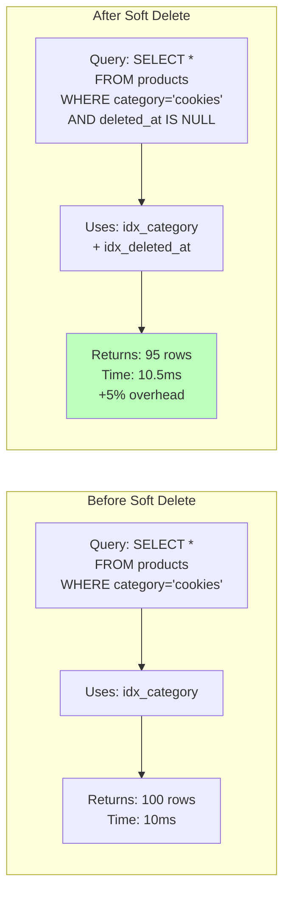
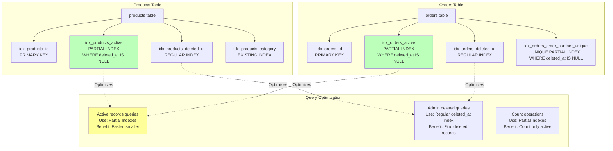
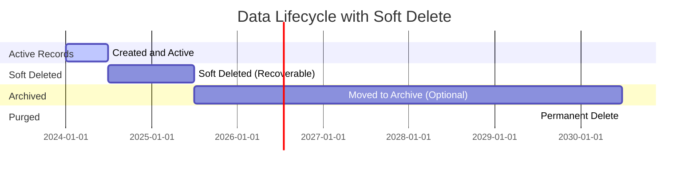
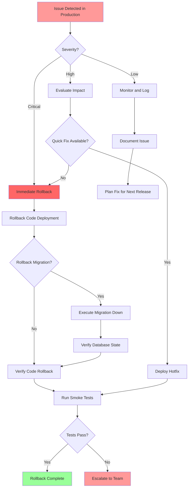

# Soft Delete Implementation - Visual Diagrams

This document contains detailed visual diagrams for the soft delete implementation.

## 1. Entity Relationship Diagram with Soft Delete

```mermaid
erDiagram
    PRODUCT ||--o{ ORDER_ITEM : "referenced by"
    ORDER ||--|{ ORDER_ITEM : contains
    ORDER ||--|| PAYMENT : has
    
    PRODUCT {
        uuid id PK "Primary Key"
        string name "Product name"
        text description "Optional description"
        decimal price "Price in currency"
        string category "Product category"
        enum business_type "retail/wholesale"
        enum status "available/unavailable"
        string image_url "Product image URL"
        timestamp created_at "Creation timestamp"
        timestamp updated_at "Last update timestamp"
        timestamp deleted_at "SOFT DELETE: NULL or deletion timestamp"
    }
    
    ORDER {
        uuid id PK "Primary Key"
        string order_number UK "Unique order number"
        enum order_type "temporary/permanent"
        enum business_model "retail/wholesale"
        decimal total_amount "Total order amount"
        enum status "draft/pending/paid/cancelled"
        string customer_name "Customer name"
        string customer_phone "Customer phone"
        text notes "Order notes"
        timestamp confirmed_at "Order confirmation time"
        timestamp created_at "Creation timestamp"
        timestamp updated_at "Last update timestamp"
        timestamp deleted_at "SOFT DELETE: NULL or deletion timestamp"
    }
    
    ORDER_ITEM {
        uuid id PK "Primary Key"
        uuid order_id FK "Foreign key to ORDER"
        uuid product_id FK "Foreign key to PRODUCT"
        integer quantity "Item quantity"
        decimal unit_price "Price per unit"
        decimal subtotal "quantity * unit_price"
        text notes "Item notes"
        timestamp created_at "Creation timestamp"
        timestamp updated_at "Last update timestamp"
        timestamp deleted_at "SOFT DELETE: NULL or deletion timestamp"
    }
    
    PAYMENT {
        uuid id PK "Primary Key"
        uuid order_id FK-UK "Foreign key to ORDER (unique)"
        decimal amount "Payment amount"
        enum method "cash/bank_transfer/vietqr"
        enum status "pending/paid/failed"
        string transaction_id "External transaction ID"
        text vietqr_data "VietQR JSON data"
        timestamp paid_at "Payment completion time"
        text notes "Payment notes"
        timestamp created_at "Creation timestamp"
        timestamp updated_at "Last update timestamp"
        timestamp deleted_at "SOFT DELETE: NULL or deletion timestamp"
    }
```

## 2. Soft Delete Flow - Sequence Diagrams

### 2.1 Product Soft Delete Flow



### 2.2 Order Cascade Soft Delete Flow



### 2.3 Restore Soft-Deleted Record Flow



## 3. State Diagram - Record Lifecycle



## 4. Component Architecture Diagram



## 5. Query Performance - Before and After



## 6. Database Index Strategy



## 7. Cascade Delete Visualization

```mermaid
graph TD
    O[Order<br/>id: 123<br/>order_number: ORD-001<br/>deleted_at: NULL]
    OI1[OrderItem 1<br/>id: 456<br/>quantity: 2<br/>deleted_at: NULL]
    OI2[OrderItem 2<br/>id: 789<br/>quantity: 1<br/>deleted_at: NULL]
    P[Payment<br/>id: 999<br/>amount: 100.00<br/>deleted_at: NULL]
    
    O --> OI1
    O --> OI2
    O --> P
    
    SD[Soft Delete Order 123<br/>SET deleted_at = NOW()]
    
    SD -.->|Cascades| O2[Order<br/>deleted_at: 2024-12-17]
    SD -.->|Cascades| OI1_2[OrderItem 1<br/>deleted_at: 2024-12-17]
    SD -.->|Cascades| OI2_2[OrderItem 2<br/>deleted_at: 2024-12-17]
    SD -.->|Cascades| P2[Payment<br/>deleted_at: 2024-12-17]
    
    O --> SD
    
    style SD fill:#f99,stroke:#333,stroke-width:3px
    style O2 fill:#fcc
    style OI1_2 fill:#fcc
    style OI2_2 fill:#fcc
    style P2 fill:#fcc
```

## 8. Data Retention Timeline



## 9. Transaction Flow for Cascade Delete

```mermaid
flowchart TD
    START([Delete Order Request]) --> CHECK{Order Exists?}
    CHECK -->|No| ERR404[Return 404 Not Found]
    CHECK -->|Yes| DRAFT{Status = DRAFT?}
    
    DRAFT -->|No| ERR400[Return 400 Bad Request<br/>Only DRAFT can be deleted]
    DRAFT -->|Yes| TXN[BEGIN TRANSACTION]
    
    TXN --> DEL_ORD[UPDATE orders<br/>SET deleted_at = NOW()]
    DEL_ORD --> DEL_ITEMS[UPDATE order_items<br/>SET deleted_at = NOW()]
    DEL_ITEMS --> DEL_PAY[UPDATE payments<br/>SET deleted_at = NOW()]
    
    DEL_PAY --> COMMIT{Commit OK?}
    COMMIT -->|Success| SUCCESS[COMMIT TRANSACTION]
    COMMIT -->|Error| ROLLBACK[ROLLBACK TRANSACTION]
    
    SUCCESS --> RESP204[Return 204 No Content]
    ROLLBACK --> ERR500[Return 500 Internal Error]
    
    ERR404 --> END([End])
    ERR400 --> END
    ERR500 --> END
    RESP204 --> END
    
    style TXN fill:#9cf
    style SUCCESS fill:#9f9
    style ROLLBACK fill:#f99
```

## 10. Monitoring Dashboard Layout

```mermaid
graph TB
    subgraph "Soft Delete Monitoring Dashboard"
        M1[Active vs Deleted Records]
        M2[Deletion Rate Timeline]
        M3[Query Performance]
        M4[Database Size Growth]
        M5[Top Deleted Entities]
        M6[Restore Operations]
        
        M1 --> CHART1[Bar Chart:<br/>Active | Deleted per table]
        M2 --> CHART2[Line Chart:<br/>Deletions over time]
        M3 --> CHART3[Line Chart:<br/>Query latency p95/p99]
        M4 --> CHART4[Area Chart:<br/>Table sizes over time]
        M5 --> CHART5[Table:<br/>Most deleted records]
        M6 --> CHART6[Counter:<br/>Restore operations count]
    end
    
    subgraph "Alerts"
        A1[High deletion rate]
        A2[Performance degradation]
        A3[Database size threshold]
    end
    
    M2 -.->|Triggers| A1
    M3 -.->|Triggers| A2
    M4 -.->|Triggers| A3
    
    style M1 fill:#9cf
    style M2 fill:#9cf
    style M3 fill:#9cf
    style A1 fill:#f99
    style A2 fill:#f99
    style A3 fill:#f99
```

## 11. Rollback Strategy



## Usage Notes

These diagrams are created using Mermaid syntax and can be rendered in:
- GitHub/GitLab markdown files
- VS Code with Mermaid preview extensions
- Documentation sites (MkDocs, Docusaurus, etc.)
- Mermaid Live Editor: https://mermaid.live

To edit these diagrams:
1. Copy the mermaid code block
2. Paste into Mermaid Live Editor
3. Make modifications
4. Copy back to this file

To export as images:
1. Open in Mermaid Live Editor
2. Use export function to save as PNG/SVG
3. Include images in presentation materials
