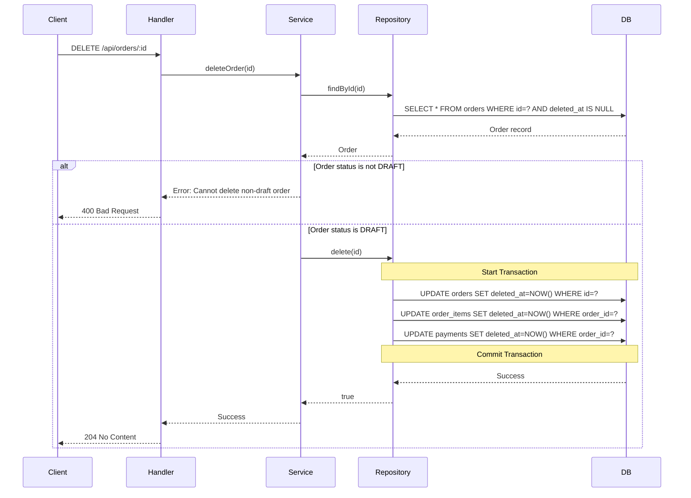
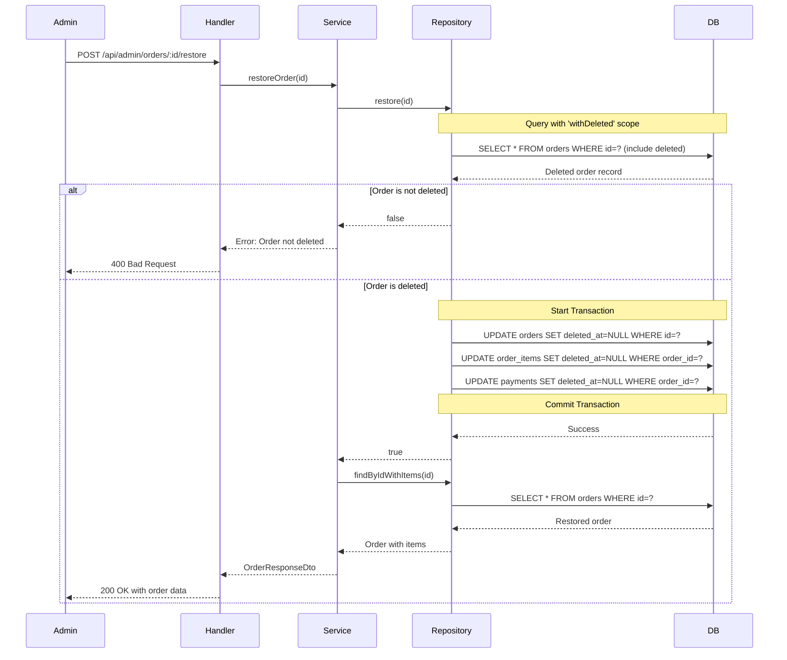
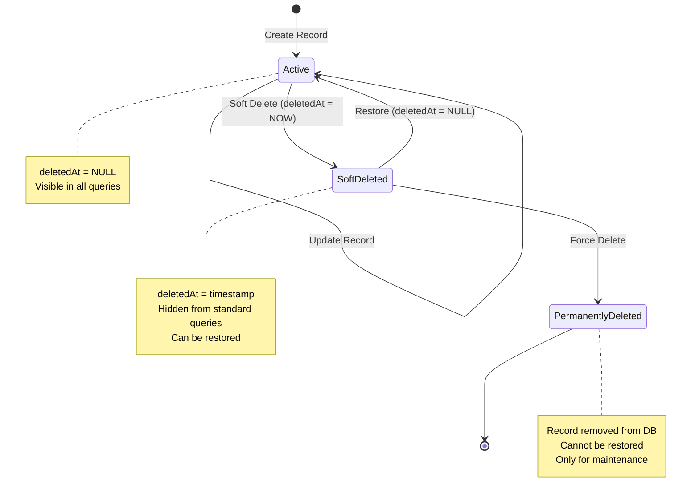
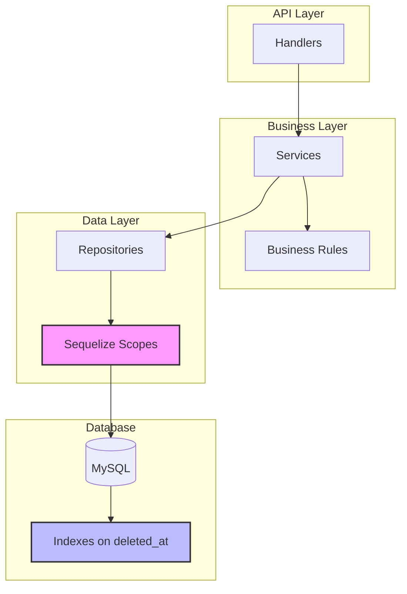

# Soft Delete Implementation Specification

## Business Information

- **Business Domain**: Cookie Sales Management / E-commerce CMS
- **Core Business Objectives**: 
  - Enable data recovery and audit trail by implementing soft delete
  - Maintain data integrity and historical records
  - Support compliance and data retention policies
  - Allow administrators to recover accidentally deleted records
- **Target Users**: 
  - System Administrators (data recovery)
  - Business Managers (audit trails)
  - Developers (consistent delete patterns)
- **Business Value**: 
  - Reduced risk of data loss from accidental deletions
  - Better audit capabilities for business intelligence
  - Compliance with data retention regulations
  - Ability to restore deleted products, orders, and payments
- **Success Metrics**:
  - Zero permanent data loss from accidental deletions
  - 100% of delete operations use soft delete pattern
  - Reduced customer support tickets related to data recovery
  - Complete audit trail for all delete operations

---

## Business Rules

### BR-001: Soft Delete Application Scope
- **Condition**: When any delete operation is performed on Products, Orders, or Payments
- **Action**: Set `deletedAt` timestamp instead of removing the record from database
- **Priority**: Critical
- **Exceptions**: 
  - System maintenance operations may perform hard deletes
  - Cascade deletes on related records should follow the same soft delete pattern

### BR-002: Data Visibility After Soft Delete
- **Condition**: When a record has `deletedAt` value set (not null)
- **Action**: 
  - Record is excluded from all standard queries
  - Record can only be accessed through admin/recovery endpoints
  - Related records visibility follows parent record state
- **Priority**: Critical
- **Exceptions**: 
  - Admin recovery endpoints can view soft-deleted records
  - Audit logs should reference soft-deleted records

### BR-003: Soft Delete of Related Records
- **Condition**: When a parent record is soft deleted
- **Action**:
  - Order soft delete: Soft delete all associated OrderItems and Payment
  - Product soft delete: Do NOT soft delete Orders/OrderItems (maintain order history)
  - Payment soft delete: Independent operation (already tied to Order)
- **Priority**: High
- **Exceptions**: None

### BR-004: Unique Constraints with Soft Delete
- **Condition**: When validating unique fields (orderNumber, product name with constraints)
- **Action**: Unique constraints should only apply to non-deleted records (deletedAt IS NULL)
- **Priority**: High
- **Exceptions**: None

### BR-005: Query Filtering
- **Condition**: All read operations (findAll, findById, count, etc.)
- **Action**: Automatically filter out soft-deleted records by adding `deletedAt IS NULL` condition
- **Priority**: Critical
- **Exceptions**: Explicit recovery/admin queries

---

## Data Type Setup

### Enums

No new enums required for this feature.

### Value Objects

```typescript
/**
 * Soft delete metadata
 * Tracks when and why a record was soft deleted
 */
interface SoftDeleteMetadata {
  deletedAt: Date;
  deletedBy?: string; // Optional: user ID who performed deletion
  deleteReason?: string; // Optional: reason for deletion
}
```

### DTOs (Data Transfer Objects)

```typescript
/**
 * Soft delete request DTO
 * Optional metadata for delete operations
 */
interface SoftDeleteRequestDto {
  reason?: string;
  deletedBy?: string;
}

/**
 * Recovery request DTO
 * For restoring soft-deleted records
 */
interface RecoveryRequestDto {
  recordId: string;
  recoveredBy?: string;
  recoveryReason?: string;
}
```

### Type Guards

```typescript
/**
 * Check if a model instance is soft deleted
 */
function isSoftDeleted(record: { deletedAt?: Date | null }): boolean {
  return record.deletedAt !== null && record.deletedAt !== undefined;
}

/**
 * Check if a timestamp is valid
 */
function isValidDeleteTimestamp(deletedAt: unknown): deletedAt is Date {
  return deletedAt instanceof Date && !isNaN(deletedAt.getTime());
}
```

---

## Code Structure Setup

### Directory Structure

```
bakery-cms-api/
├── packages/
│   ├── database/
│   │   └── src/
│   │       ├── models/
│   │       │   ├── product.model.ts          # Add deletedAt field
│   │       │   ├── order.model.ts            # Add deletedAt field
│   │       │   ├── order-item.model.ts       # Add deletedAt field
│   │       │   └── payment.model.ts          # Add deletedAt field
│   │       ├── migrations/
│   │       │   └── YYYYMMDDHHMMSS-add-soft-delete-fields.ts
│   │       └── config/
│   │           └── sequelize.ts              # Add global soft delete scope
│   ├── api/
│   │   └── src/
│   │       ├── modules/
│   │       │   ├── products/
│   │       │   │   ├── repositories/
│   │       │   │   │   └── products.repositories.ts    # Update delete method
│   │       │   │   └── services/
│   │       │   │       └── products.services.ts        # Update delete logic
│   │       │   ├── orders/
│   │       │   │   ├── repositories/
│   │       │   │   │   └── orders.repositories.ts      # Update delete method
│   │       │   │   └── services/
│   │       │   │       └── orders.services.ts          # Update delete logic
│   │       │   └── payments/
│   │       │       ├── repositories/
│   │       │       │   └── payments.repositories.ts    # Update delete method
│   │       │       └── services/
│   │       │           └── payments.services.ts        # Update delete logic
│   │       └── middleware/
│   │           └── soft-delete-filter.ts      # New: Auto-filter middleware
│   └── common/
│       └── src/
│           └── types/
│               └── soft-delete.types.ts        # New: Soft delete types
```

### Layer Responsibilities

- **Models**: Define `deletedAt` field with proper Sequelize configuration
- **Migrations**: Add `deletedAt` column to existing tables with indexes
- **Repositories**: 
  - Update `delete` methods to perform soft delete (UPDATE instead of DELETE)
  - Add global scopes to filter out soft-deleted records
  - Implement recovery methods for admin operations
- **Services**: Update business logic to handle soft delete semantics
- **Middleware**: Create Sequelize global scope to auto-filter deleted records
- **Types**: Define TypeScript types for soft delete operations

---

## Data Model

### Entity Definitions

#### Updated Product Model
```typescript
@Entity('products')
class Product {
  @PrimaryKey()
  id: string;
  
  @Property()
  name: string;
  
  @Property()
  description: string | null;
  
  @Property()
  price: number;
  
  @Property()
  category: string | null;
  
  @Enum(() => BusinessType)
  businessType: BusinessType;
  
  @Enum(() => ProductStatus)
  status: ProductStatus;
  
  @Property()
  imageUrl: string | null;
  
  @Property()
  createdAt: Date;
  
  @Property()
  updatedAt: Date;
  
  // NEW: Soft delete field
  @Property()
  deletedAt: Date | null;
}
```

#### Updated Order Model
```typescript
@Entity('orders')
class Order {
  @PrimaryKey()
  id: string;
  
  @Property()
  orderNumber: string;
  
  @Enum(() => OrderType)
  orderType: OrderType;
  
  @Enum(() => BusinessModel)
  businessModel: BusinessModel;
  
  @Property()
  totalAmount: number;
  
  @Enum(() => OrderStatus)
  status: OrderStatus;
  
  @Property()
  customerName: string | null;
  
  @Property()
  customerPhone: string | null;
  
  @Property()
  notes: string | null;
  
  @Property()
  confirmedAt: Date | null;
  
  @Property()
  createdAt: Date;
  
  @Property()
  updatedAt: Date;
  
  // NEW: Soft delete field
  @Property()
  deletedAt: Date | null;
  
  @OneToMany(() => OrderItem, item => item.order)
  items: OrderItem[];
  
  @OneToOne(() => Payment, payment => payment.order)
  payment: Payment | null;
}
```

#### Updated OrderItem Model
```typescript
@Entity('order_items')
class OrderItem {
  @PrimaryKey()
  id: string;
  
  @Property()
  orderId: string;
  
  @Property()
  productId: string;
  
  @Property()
  quantity: number;
  
  @Property()
  unitPrice: number;
  
  @Property()
  subtotal: number;
  
  @Property()
  notes: string | null;
  
  @Property()
  createdAt: Date;
  
  @Property()
  updatedAt: Date;
  
  // NEW: Soft delete field
  @Property()
  deletedAt: Date | null;
  
  @ManyToOne(() => Order, order => order.items)
  order: Order;
}
```

#### Updated Payment Model
```typescript
@Entity('payments')
class Payment {
  @PrimaryKey()
  id: string;
  
  @Property()
  orderId: string;
  
  @Property()
  amount: number;
  
  @Enum(() => PaymentMethod)
  method: PaymentMethod;
  
  @Enum(() => PaymentStatus)
  status: PaymentStatus;
  
  @Property()
  transactionId: string | null;
  
  @Property()
  vietqrData: string | null;
  
  @Property()
  paidAt: Date | null;
  
  @Property()
  notes: string | null;
  
  @Property()
  createdAt: Date;
  
  @Property()
  updatedAt: Date;
  
  // NEW: Soft delete field
  @Property()
  deletedAt: Date | null;
  
  @OneToOne(() => Order, order => order.payment)
  order: Order;
}
```

### Relationships

No changes to existing relationships. All relationships remain the same:
- Order (1) -> (*) OrderItems
- Order (1) -> (1) Payment
- OrderItem (*) -> (1) Product

### Indexes

#### New Indexes for Soft Delete
```sql
-- Products table
CREATE INDEX idx_products_deleted_at ON products(deleted_at);
CREATE INDEX idx_products_active ON products(deleted_at) WHERE deleted_at IS NULL;

-- Orders table
CREATE INDEX idx_orders_deleted_at ON orders(deleted_at);
CREATE INDEX idx_orders_active ON orders(deleted_at) WHERE deleted_at IS NULL;

-- Order Items table
CREATE INDEX idx_order_items_deleted_at ON order_items(deleted_at);
CREATE INDEX idx_order_items_active ON order_items(deleted_at) WHERE deleted_at IS NULL;

-- Payments table
CREATE INDEX idx_payments_deleted_at ON payments(deleted_at);
CREATE INDEX idx_payments_active ON payments(deleted_at) WHERE deleted_at IS NULL;
```

### Constraints

#### Updated Unique Constraints
```sql
-- Update orderNumber unique constraint to only apply to non-deleted orders
ALTER TABLE orders DROP CONSTRAINT IF EXISTS orders_order_number_key;
CREATE UNIQUE INDEX orders_order_number_unique 
  ON orders(order_number) 
  WHERE deleted_at IS NULL;

-- Payment orderId should be unique only for non-deleted payments
ALTER TABLE payments DROP CONSTRAINT IF EXISTS payments_order_id_key;
CREATE UNIQUE INDEX payments_order_id_unique 
  ON payments(order_id) 
  WHERE deleted_at IS NULL;
```

#### Soft Delete Constraint
```sql
-- Ensure deletedAt is either NULL or a valid timestamp
ALTER TABLE products ADD CONSTRAINT chk_products_deleted_at 
  CHECK (deleted_at IS NULL OR deleted_at <= CURRENT_TIMESTAMP);

ALTER TABLE orders ADD CONSTRAINT chk_orders_deleted_at 
  CHECK (deleted_at IS NULL OR deleted_at <= CURRENT_TIMESTAMP);

ALTER TABLE order_items ADD CONSTRAINT chk_order_items_deleted_at 
  CHECK (deleted_at IS NULL OR deleted_at <= CURRENT_TIMESTAMP);

ALTER TABLE payments ADD CONSTRAINT chk_payments_deleted_at 
  CHECK (deleted_at IS NULL OR deleted_at <= CURRENT_TIMESTAMP);
```

---

## Infrastructure Setup

### Database

- **Type**: MySQL 8.0+ (current)
- **Migration Strategy**: 
  - Create migration to add `deletedAt` column to all relevant tables
  - Add indexes for performance optimization
  - Update unique constraints to work with soft delete
  - Backfill existing data with NULL for deletedAt
- **Rollback Strategy**: 
  - Migration down should remove `deletedAt` columns
  - Restore original unique constraints
  - No data loss as soft-deleted records remain

### Sequelize Configuration

**Current Configuration** (`packages/database/src/config/database.config.ts`):
```typescript
export const getDatabaseConfig = (): DatabaseConfig => {
  const baseConfig: DatabaseConfig = {
    host: process.env['DB_HOST'] || 'localhost',
    port: parseInt(process.env['DB_PORT'] || '3306', 10),
    database: process.env['DB_NAME'] || 'bakery_cms',
    username: process.env['DB_USERNAME'] || 'root',
    password: process.env['DB_PASSWORD'] || '',
    dialect: 'mysql',
    pool: {
      max: 5,
      min: 0,
      acquire: 30000,
      idle: 10000,
    },
    logging: process.env['NODE_ENV'] === 'development' ? console.log : false,
  };
  // ... SSL configuration ...
  return baseConfig;
};
```

**Note:** The current Sequelize configuration does **NOT** have global `paranoid` mode enabled, which is intentional. This allows us to implement manual soft delete with more control and flexibility.

**Model-Level Scope Configuration** (to be added to each model):
```typescript
// Applied at model initialization level, not global Sequelize config
{
  paranoid: false, // We handle soft delete manually for more control
  defaultScope: {
    where: {
      deletedAt: null
    }
  },
  scopes: {
    // Scope to include soft-deleted records
    withDeleted: {
      where: {}
    },
    // Scope to show only soft-deleted records
    onlyDeleted: {
      where: {
        deletedAt: {
          [Op.ne]: null
        }
      }
    }
  }
}
```

**Why Not Use Sequelize Paranoid Mode:**
- Current configuration is clean without paranoid mode
- Manual implementation provides more control over delete behavior
- Allows custom cascade delete logic for orders
- Better fits with functional programming patterns
- No breaking changes to existing configuration

### Logging & Monitoring

- **Delete Operations**: Log all soft delete operations with metadata
  ```typescript
  logger.info('Soft delete performed', {
    entity: 'Product',
    entityId: product.id,
    deletedAt: new Date(),
    deletedBy: userId,
    reason: reason
  });
  ```
- **Metrics**: Track soft delete vs hard delete operations
- **Alerts**: Alert on unusual deletion patterns (bulk deletes)

---

## Technical Implementation

### Migration File

```typescript
// File: packages/database/src/migrations/YYYYMMDDHHMMSS-add-soft-delete-fields.ts

import { QueryInterface, DataTypes } from 'sequelize';

export const up = async (queryInterface: QueryInterface): Promise<void> => {
  // Add deletedAt column to products
  await queryInterface.addColumn('products', 'deleted_at', {
    type: DataTypes.DATE,
    allowNull: true,
    defaultValue: null,
  });

  // Add deletedAt column to orders
  await queryInterface.addColumn('orders', 'deleted_at', {
    type: DataTypes.DATE,
    allowNull: true,
    defaultValue: null,
  });

  // Add deletedAt column to order_items
  await queryInterface.addColumn('order_items', 'deleted_at', {
    type: DataTypes.DATE,
    allowNull: true,
    defaultValue: null,
  });

  // Add deletedAt column to payments
  await queryInterface.addColumn('payments', 'deleted_at', {
    type: DataTypes.DATE,
    allowNull: true,
    defaultValue: null,
  });

  // Add indexes for better query performance
  await queryInterface.addIndex('products', ['deleted_at'], {
    name: 'idx_products_deleted_at',
  });

  await queryInterface.addIndex('orders', ['deleted_at'], {
    name: 'idx_orders_deleted_at',
  });

  await queryInterface.addIndex('order_items', ['deleted_at'], {
    name: 'idx_order_items_deleted_at',
  });

  await queryInterface.addIndex('payments', ['deleted_at'], {
    name: 'idx_payments_deleted_at',
  });

  // Update unique constraint for orders.order_number
  await queryInterface.removeConstraint('orders', 'orders_order_number_key');
  await queryInterface.sequelize.query(`
    CREATE UNIQUE INDEX orders_order_number_unique 
    ON orders(order_number) 
    WHERE deleted_at IS NULL
  `);

  // Update unique constraint for payments.order_id
  await queryInterface.removeConstraint('payments', 'payments_order_id_key');
  await queryInterface.sequelize.query(`
    CREATE UNIQUE INDEX payments_order_id_unique 
    ON payments(order_id) 
    WHERE deleted_at IS NULL
  `);
};

export const down = async (queryInterface: QueryInterface): Promise<void> => {
  // Remove indexes
  await queryInterface.removeIndex('products', 'idx_products_deleted_at');
  await queryInterface.removeIndex('orders', 'idx_orders_deleted_at');
  await queryInterface.removeIndex('order_items', 'idx_order_items_deleted_at');
  await queryInterface.removeIndex('payments', 'idx_payments_deleted_at');

  // Restore original unique constraints
  await queryInterface.sequelize.query('DROP INDEX IF EXISTS orders_order_number_unique');
  await queryInterface.addConstraint('orders', {
    fields: ['order_number'],
    type: 'unique',
    name: 'orders_order_number_key',
  });

  await queryInterface.sequelize.query('DROP INDEX IF EXISTS payments_order_id_unique');
  await queryInterface.addConstraint('payments', {
    fields: ['order_id'],
    type: 'unique',
    name: 'payments_order_id_key',
  });

  // Remove columns
  await queryInterface.removeColumn('payments', 'deleted_at');
  await queryInterface.removeColumn('order_items', 'deleted_at');
  await queryInterface.removeColumn('orders', 'deleted_at');
  await queryInterface.removeColumn('products', 'deleted_at');
};
```

### Model Updates

#### Product Model Update
```typescript
// File: packages/database/src/models/product.model.ts

export class ProductModel extends Model {
  declare id: string;
  declare name: string;
  declare description: string | null;
  declare price: number;
  declare category: string | null;
  declare businessType: string;
  declare status: string;
  declare imageUrl: string | null;
  declare readonly createdAt: Date;
  declare readonly updatedAt: Date;
  declare deletedAt: Date | null; // NEW FIELD
}

export const initProductModel = (sequelize: Sequelize): typeof ProductModel => {
  ProductModel.init(
    {
      // ... existing fields ...
      
      deletedAt: {
        type: DataTypes.DATE,
        allowNull: true,
        defaultValue: null,
        field: 'deleted_at',
      },
    },
    {
      sequelize,
      tableName: 'products',
      timestamps: true,
      underscored: true,
      // Add default scope to filter deleted records
      defaultScope: {
        where: {
          deletedAt: null,
        },
      },
      // Add scopes for special queries
      scopes: {
        withDeleted: {
          where: {},
        },
        onlyDeleted: {
          where: {
            deletedAt: {
              [Op.ne]: null,
            },
          },
        },
      },
      indexes: [
        // ... existing indexes ...
        {
          fields: ['deleted_at'],
        },
      ],
    }
  );

  return ProductModel;
};
```

#### Order Model Update
```typescript
// File: packages/database/src/models/order.model.ts

export class OrderModel extends Model {
  declare id: string;
  declare orderNumber: string;
  declare orderType: string;
  declare businessModel: string;
  declare totalAmount: number;
  declare status: string;
  declare customerName: string | null;
  declare customerPhone: string | null;
  declare notes: string | null;
  declare confirmedAt: Date | null;
  declare readonly createdAt: Date;
  declare readonly updatedAt: Date;
  declare deletedAt: Date | null; // NEW FIELD
}

export const initOrderModel = (sequelize: Sequelize): typeof OrderModel => {
  OrderModel.init(
    {
      // ... existing fields ...
      
      deletedAt: {
        type: DataTypes.DATE,
        allowNull: true,
        defaultValue: null,
        field: 'deleted_at',
      },
    },
    {
      sequelize,
      tableName: 'orders',
      timestamps: true,
      underscored: true,
      // Add default scope to filter deleted records
      defaultScope: {
        where: {
          deletedAt: null,
        },
      },
      scopes: {
        withDeleted: {
          where: {},
        },
        onlyDeleted: {
          where: {
            deletedAt: {
              [Op.ne]: null,
            },
          },
        },
      },
      indexes: [
        // ... existing indexes ...
        {
          fields: ['deleted_at'],
        },
      ],
    }
  );

  return OrderModel;
};
```

#### OrderItem Model Update
```typescript
// File: packages/database/src/models/order-item.model.ts

export class OrderItemModel extends Model {
  declare id: string;
  declare orderId: string;
  declare productId: string;
  declare quantity: number;
  declare unitPrice: number;
  declare subtotal: number;
  declare notes: string | null;
  declare readonly createdAt: Date;
  declare readonly updatedAt: Date;
  declare deletedAt: Date | null; // NEW FIELD
}

export const initOrderItemModel = (sequelize: Sequelize): typeof OrderItemModel => {
  OrderItemModel.init(
    {
      // ... existing fields ...
      
      deletedAt: {
        type: DataTypes.DATE,
        allowNull: true,
        defaultValue: null,
        field: 'deleted_at',
      },
    },
    {
      sequelize,
      tableName: 'order_items',
      timestamps: true,
      underscored: true,
      defaultScope: {
        where: {
          deletedAt: null,
        },
      },
      scopes: {
        withDeleted: {
          where: {},
        },
        onlyDeleted: {
          where: {
            deletedAt: {
              [Op.ne]: null,
            },
          },
        },
      },
      indexes: [
        // ... existing indexes ...
        {
          fields: ['deleted_at'],
        },
      ],
    }
  );

  return OrderItemModel;
};
```

#### Payment Model Update
```typescript
// File: packages/database/src/models/payment.model.ts

export class PaymentModel extends Model {
  declare id: string;
  declare orderId: string;
  declare amount: number;
  declare method: string;
  declare status: string;
  declare transactionId: string | null;
  declare vietqrData: string | null;
  declare paidAt: Date | null;
  declare notes: string | null;
  declare readonly createdAt: Date;
  declare readonly updatedAt: Date;
  declare deletedAt: Date | null; // NEW FIELD
}

export const initPaymentModel = (sequelize: Sequelize): typeof PaymentModel => {
  PaymentModel.init(
    {
      // ... existing fields ...
      
      deletedAt: {
        type: DataTypes.DATE,
        allowNull: true,
        defaultValue: null,
        field: 'deleted_at',
      },
    },
    {
      sequelize,
      tableName: 'payments',
      timestamps: true,
      underscored: true,
      defaultScope: {
        where: {
          deletedAt: null,
        },
      },
      scopes: {
        withDeleted: {
          where: {},
        },
        onlyDeleted: {
          where: {
            deletedAt: {
              [Op.ne]: null,
            },
          },
        },
      },
      indexes: [
        // ... existing indexes ...
        {
          fields: ['deleted_at'],
        },
      ],
    }
  );

  return PaymentModel;
};
```

### Repository Updates

#### Product Repository Update
```typescript
// File: packages/api/src/modules/products/repositories/products.repositories.ts

/**
 * Soft delete product by ID
 * Sets deletedAt timestamp instead of removing record
 * Returns true if deleted, false if not found
 */
const deleteProduct = async (id: string): Promise<boolean> => {
  const product = await model.findByPk(id);

  if (!product) {
    return false;
  }

  // Perform soft delete by setting deletedAt
  await product.update({
    deletedAt: new Date(),
  });

  return true;
};

/**
 * Restore soft-deleted product
 * Sets deletedAt back to null
 */
const restoreProduct = async (id: string): Promise<boolean> => {
  const product = await model.scope('withDeleted').findByPk(id);

  if (!product || !product.deletedAt) {
    return false;
  }

  await product.update({
    deletedAt: null,
  });

  return true;
};

/**
 * Permanently delete product (hard delete)
 * Should only be used for maintenance operations
 */
const forceDeleteProduct = async (id: string): Promise<boolean> => {
  const rowsDeleted = await model.scope('withDeleted').destroy({
    where: { id },
    force: true,
  });

  return rowsDeleted > 0;
};

return {
  findById,
  findAll,
  create,
  update,
  delete: deleteProduct,
  restore: restoreProduct, // NEW
  forceDelete: forceDeleteProduct, // NEW
  count,
};
```

#### Order Repository Update
```typescript
// File: packages/api/src/modules/orders/repositories/orders.repositories.ts

/**
 * Soft delete order by ID
 * Also soft deletes all associated order items and payment
 * Returns true if deleted, false if not found
 */
const deleteOrder = async (id: string): Promise<boolean> => {
  const order = await model.findByPk(id);

  if (!order) {
    return false;
  }

  const deletedAt = new Date();

  // Start transaction for data consistency
  const transaction = await model.sequelize!.transaction();

  try {
    // Soft delete the order
    await order.update({ deletedAt }, { transaction });

    // Soft delete all order items
    await orderItemModel.update(
      { deletedAt },
      {
        where: { orderId: id },
        transaction,
      }
    );

    // Soft delete associated payment if exists
    await model.sequelize!.models.Payment.update(
      { deletedAt },
      {
        where: { orderId: id },
        transaction,
      }
    );

    await transaction.commit();
    return true;
  } catch (error) {
    await transaction.rollback();
    throw error;
  }
};

/**
 * Restore soft-deleted order
 * Also restores associated order items and payment
 */
const restoreOrder = async (id: string): Promise<boolean> => {
  const order = await model.scope('withDeleted').findByPk(id);

  if (!order || !order.deletedAt) {
    return false;
  }

  const transaction = await model.sequelize!.transaction();

  try {
    // Restore the order
    await order.update({ deletedAt: null }, { transaction });

    // Restore all order items
    await orderItemModel.update(
      { deletedAt: null },
      {
        where: { orderId: id },
        transaction,
      }
    );

    // Restore associated payment if exists
    await model.sequelize!.models.Payment.update(
      { deletedAt: null },
      {
        where: { orderId: id },
        transaction,
      }
    );

    await transaction.commit();
    return true;
  } catch (error) {
    await transaction.rollback();
    throw error;
  }
};

return {
  findById,
  findByIdWithItems,
  findAll,
  create,
  update,
  updateStatus,
  delete: deleteOrder,
  restore: restoreOrder, // NEW
  count,
  findByOrderNumber,
  items: itemRepository,
};
```

#### Payment Repository Update
```typescript
// File: packages/api/src/modules/payments/repositories/payments.repositories.ts

/**
 * Soft delete payment by ID
 * Returns true if deleted, false if not found
 */
const deletePayment = async (id: string): Promise<boolean> => {
  const payment = await model.findByPk(id);

  if (!payment) {
    return false;
  }

  await payment.update({
    deletedAt: new Date(),
  });

  return true;
};

/**
 * Restore soft-deleted payment
 */
const restorePayment = async (id: string): Promise<boolean> => {
  const payment = await model.scope('withDeleted').findByPk(id);

  if (!payment || !payment.deletedAt) {
    return false;
  }

  await payment.update({
    deletedAt: null,
  });

  return true;
};

return {
  findById,
  findByOrderId,
  findAll,
  create,
  update,
  updateStatus,
  delete: deletePayment,
  restore: restorePayment, // NEW
  count,
};
```

### Service Updates

#### Product Service Update
```typescript
// File: packages/api/src/modules/products/services/products.services.ts

/**
 * Soft delete product by ID
 */
const deleteProduct = async (id: string): Promise<Result<void, AppError>> => {
  try {
    logger.info('Soft deleting product', { productId: id });

    const deleted = await repository.delete(id);

    if (!deleted) {
      logger.warn('Product not found for deletion', { productId: id });
      return err(createNotFoundError('Product', id));
    }

    logger.info('Product soft deleted successfully', { productId: id });

    return ok(undefined);
  } catch (error) {
    logger.error('Failed to soft delete product', { error, productId: id });
    return err(createDatabaseError('Failed to delete product'));
  }
};

/**
 * Restore soft-deleted product
 */
const restoreProduct = async (id: string): Promise<Result<ProductResponseDto, AppError>> => {
  try {
    logger.info('Restoring soft-deleted product', { productId: id });

    const restored = await repository.restore(id);

    if (!restored) {
      logger.warn('Product not found or not deleted', { productId: id });
      return err(createNotFoundError('Product', id));
    }

    // Fetch the restored product
    const product = await repository.findById(id);
    
    if (!product) {
      return err(createDatabaseError('Failed to fetch restored product'));
    }

    logger.info('Product restored successfully', { productId: id });

    return ok(toProductResponseDto(product));
  } catch (error) {
    logger.error('Failed to restore product', { error, productId: id });
    return err(createDatabaseError('Failed to restore product'));
  }
};

return {
  createProduct,
  getProductById,
  getAllProducts,
  updateProduct,
  deleteProduct,
  restoreProduct, // NEW
};
```

#### Order Service Update
```typescript
// File: packages/api/src/modules/orders/services/orders.services.ts

/**
 * Soft delete order by ID
 * Business rule: Only DRAFT orders can be deleted
 */
const deleteOrder = async (id: string): Promise<Result<void, AppError>> => {
  try {
    logger.info('Soft deleting order', { orderId: id });

    const order = await repository.findById(id);

    if (!order) {
      logger.warn('Order not found for deletion', { orderId: id });
      return err(createNotFoundError('Order', id));
    }

    // Business rule: Only allow deletion of draft orders
    if (order.status !== OrderStatus.DRAFT) {
      return err(
        createBusinessRuleError(
          `Cannot delete order with status: ${order.status}. Only draft orders can be deleted.`
        )
      );
    }

    const deleted = await repository.delete(id);

    if (!deleted) {
      return err(createDatabaseError('Failed to delete order'));
    }

    logger.info('Order soft deleted successfully', { orderId: id });

    return ok(undefined);
  } catch (error) {
    logger.error('Failed to soft delete order', { error, orderId: id });
    return err(createDatabaseError('Failed to delete order'));
  }
};

/**
 * Restore soft-deleted order
 */
const restoreOrder = async (id: string): Promise<Result<OrderResponseDto, AppError>> => {
  try {
    logger.info('Restoring soft-deleted order', { orderId: id });

    const restored = await repository.restore(id);

    if (!restored) {
      logger.warn('Order not found or not deleted', { orderId: id });
      return err(createNotFoundError('Order', id));
    }

    // Fetch the restored order with items
    const order = await repository.findByIdWithItems(id);
    
    if (!order) {
      return err(createDatabaseError('Failed to fetch restored order'));
    }

    logger.info('Order restored successfully', { orderId: id });

    return ok(toOrderResponseDto(order));
  } catch (error) {
    logger.error('Failed to restore order', { error, orderId: id });
    return err(createDatabaseError('Failed to restore order'));
  }
};

return {
  createOrder,
  getOrderById,
  getAllOrders,
  updateOrder,
  confirmOrder,
  cancelOrder,
  deleteOrder,
  restoreOrder, // NEW
};
```

### Common Types

```typescript
// File: packages/common/src/types/soft-delete.types.ts

/**
 * Base interface for models with soft delete support
 */
export type SoftDeletable = {
  deletedAt: Date | null;
};

/**
 * Utility type to include soft-deleted records
 */
export type WithDeleted<T> = T & {
  includeDeleted: true;
};

/**
 * Soft delete filter options
 */
export type SoftDeleteFilter = 
  | 'active'        // Only non-deleted records (default)
  | 'deleted'       // Only deleted records
  | 'all';          // All records including deleted

/**
 * Soft delete metadata for logging
 */
export type SoftDeleteMetadata = {
  entityType: string;
  entityId: string;
  deletedAt: Date;
  deletedBy?: string;
  reason?: string;
};
```

---

## Diagrams

### Database ER Diagram with Soft Delete

```mermaid
erDiagram
    PRODUCT ||--o{ ORDER_ITEM : "referenced by"
    ORDER ||--|{ ORDER_ITEM : contains
    ORDER ||--|| PAYMENT : has
    
    PRODUCT {
        uuid id PK
        string name
        text description
        decimal price
        string category
        enum business_type
        enum status
        string image_url
        timestamp created_at
        timestamp updated_at
        timestamp deleted_at "NEW - Soft delete"
    }
    
    ORDER {
        uuid id PK
        string order_number UK
        enum order_type
        enum business_model
        decimal total_amount
        enum status
        string customer_name
        string customer_phone
        text notes
        timestamp confirmed_at
        timestamp created_at
        timestamp updated_at
        timestamp deleted_at "NEW - Soft delete"
    }
    
    ORDER_ITEM {
        uuid id PK
        uuid order_id FK
        uuid product_id FK
        integer quantity
        decimal unit_price
        decimal subtotal
        text notes
        timestamp created_at
        timestamp updated_at
        timestamp deleted_at "NEW - Soft delete"
    }
    
    PAYMENT {
        uuid id PK
        uuid order_id FK UK
        decimal amount
        enum method
        enum status
        string transaction_id
        text vietqr_data
        timestamp paid_at
        text notes
        timestamp created_at
        timestamp updated_at
        timestamp deleted_at "NEW - Soft delete"
    }
```

### Sequence Diagram: Soft Delete Order Flow



### Sequence Diagram: Restore Soft-Deleted Order Flow



### State Diagram: Record Lifecycle with Soft Delete



### Component Diagram: Soft Delete Architecture



---

## API Changes

### Existing Endpoints Behavior Change

All existing DELETE endpoints will now perform soft delete instead of hard delete:

#### DELETE /api/products/:id
- **Before**: Permanently removes product from database
- **After**: Sets `deletedAt` timestamp, product hidden from queries
- **Response**: Same (204 No Content)
- **Business Rule**: Product must exist and not be already deleted

#### DELETE /api/orders/:id
- **Before**: Permanently removes order and related records
- **After**: Sets `deletedAt` on order, order items, and payment
- **Response**: Same (204 No Content)
- **Business Rule**: Only DRAFT orders can be deleted (unchanged)

#### DELETE /api/payments/:id
- **Before**: Permanently removes payment record
- **After**: Sets `deletedAt` timestamp
- **Response**: Same (204 No Content)
- **Business Rule**: Payment must exist

### New Admin Endpoints (Optional Future Enhancement)

```typescript
/**
 * Restore soft-deleted product
 * POST /api/admin/products/:id/restore
 */
interface RestoreProductResponse {
  success: boolean;
  data: ProductResponseDto;
}

/**
 * Restore soft-deleted order
 * POST /api/admin/orders/:id/restore
 */
interface RestoreOrderResponse {
  success: boolean;
  data: OrderResponseDto;
}

/**
 * Force delete (permanent)
 * DELETE /api/admin/products/:id/force
 * Requires admin privileges
 */
```

---

## Testing Strategy

### Unit Tests

```typescript
// Test soft delete on product repository
describe('ProductRepository.delete', () => {
  it('should set deletedAt timestamp instead of removing record', async () => {
    const product = await repository.create(mockProductData);
    const deleted = await repository.delete(product.id);
    
    expect(deleted).toBe(true);
    
    // Should not appear in normal query
    const found = await repository.findById(product.id);
    expect(found).toBeNull();
    
    // Should appear in withDeleted scope
    const foundWithDeleted = await ProductModel.scope('withDeleted')
      .findByPk(product.id);
    expect(foundWithDeleted).not.toBeNull();
    expect(foundWithDeleted.deletedAt).toBeInstanceOf(Date);
  });
});

// Test cascade soft delete on orders
describe('OrderRepository.delete', () => {
  it('should soft delete order and all related records', async () => {
    const order = await createTestOrderWithItems();
    const deleted = await repository.delete(order.id);
    
    expect(deleted).toBe(true);
    
    // Verify order is soft deleted
    const foundOrder = await repository.findById(order.id);
    expect(foundOrder).toBeNull();
    
    // Verify order items are soft deleted
    const items = await OrderItemModel.findAll({
      where: { orderId: order.id }
    });
    expect(items).toHaveLength(0);
    
    // Verify with withDeleted scope
    const deletedItems = await OrderItemModel.scope('withDeleted').findAll({
      where: { orderId: order.id }
    });
    expect(deletedItems.length).toBeGreaterThan(0);
    expect(deletedItems.every(item => item.deletedAt !== null)).toBe(true);
  });
});
```

### Integration Tests

```typescript
describe('DELETE /api/products/:id', () => {
  it('should soft delete product and return 204', async () => {
    const product = await createTestProduct();
    
    const response = await request(app)
      .delete(`/api/products/${product.id}`)
      .expect(204);
    
    // Verify product is not in list
    const listResponse = await request(app)
      .get('/api/products')
      .expect(200);
    
    const productIds = listResponse.body.data.map((p: any) => p.id);
    expect(productIds).not.toContain(product.id);
  });
  
  it('should return 404 when trying to delete already deleted product', async () => {
    const product = await createTestProduct();
    await repository.delete(product.id);
    
    await request(app)
      .delete(`/api/products/${product.id}`)
      .expect(404);
  });
});
```

### Migration Tests

```typescript
describe('Soft Delete Migration', () => {
  it('should add deletedAt column to all tables', async () => {
    await up(queryInterface);
    
    const productsTable = await queryInterface.describeTable('products');
    expect(productsTable.deleted_at).toBeDefined();
    expect(productsTable.deleted_at.allowNull).toBe(true);
    
    const ordersTable = await queryInterface.describeTable('orders');
    expect(ordersTable.deleted_at).toBeDefined();
    
    const orderItemsTable = await queryInterface.describeTable('order_items');
    expect(orderItemsTable.deleted_at).toBeDefined();
    
    const paymentsTable = await queryInterface.describeTable('payments');
    expect(paymentsTable.deleted_at).toBeDefined();
  });
  
  it('should rollback cleanly', async () => {
    await up(queryInterface);
    await down(queryInterface);
    
    const productsTable = await queryInterface.describeTable('products');
    expect(productsTable.deleted_at).toBeUndefined();
  });
});
```

---

## Research & Technology Decisions

### Technology Choice: Soft Delete Implementation Strategy

- **Purpose**: Implement data retention and recoverability while maintaining performance
- **Current State**: Sequelize configuration at `packages/database/src/config/database.config.ts` is clean without any global paranoid mode or soft delete settings
- **Options Considered**:
  1. **Sequelize Paranoid Mode (Global)**
     - Pros: Built-in support, automatic filtering, less code, easy to enable globally
     - Cons: Less control, opinionated naming (deletedAt fixed), harder to customize per model, requires changes to core Sequelize config
  2. **Manual Soft Delete with Model-Level Scopes** ✅ **SELECTED**
     - Pros: Full control, flexible, can customize behavior per model, fits existing clean config, no global changes needed
     - Cons: More code to maintain, need to remember to use scopes, not automatic
  3. **Separate Archive Tables**
     - Pros: Clean separation, main tables remain fast
     - Cons: Complex queries, data duplication, harder to restore
- **Selected**: Manual Soft Delete with Model-Level Scopes (Option 2)
- **Justification**: 
  - Preserves the current clean Sequelize configuration without global paranoid mode
  - Provides the right balance of control and convenience
  - Works well with existing functional programming patterns
  - Allows customization of business rules per entity type (e.g., Orders can cascade delete)
  - Maintains backward compatibility with existing queries
  - Better performance than global paranoid mode for complex queries
  - Each model can opt-in to soft delete with its own scopes
  - No breaking changes to core database configuration
- **Trade-offs**: 
  - Requires discipline to add scopes to each model that needs soft delete
  - More verbose than built-in paranoid mode
  - Need to manually handle cascade deletes
  - Each developer must understand scope usage
- **References**:
  - [Sequelize Paranoid Documentation](https://sequelize.org/docs/v6/core-concepts/paranoid/)
  - [Sequelize Scopes Documentation](https://sequelize.org/docs/v6/other-topics/scopes/)
  - [Soft Delete Best Practices](https://www.postgresql.org/docs/current/ddl-rowsecurity.html)
  - Current implementation: `bakery-cms-api/packages/database/src/config/database.config.ts`

### Business Solution: Cascade Soft Delete Strategy

- **Problem**: When an order is deleted, what happens to order items and payment?
- **Proposed Solution**: 
  - Order deletion cascades to OrderItems and Payment (all soft deleted together)
  - Product deletion does NOT cascade (preserve order history)
  - Use database transactions to ensure atomicity
- **Alternatives Considered**:
  1. No cascade - leave items orphaned
  2. Hard delete items when order soft deleted
  3. Independent soft deletes for all entities
- **Expected Impact**: 
  - Maintains referential integrity
  - Enables complete order recovery
  - Preserves business analytics even for deleted orders
- **Risk Assessment**: 
  - Risk: Transaction failures could leave inconsistent state
  - Risk: Performance impact on order deletion
- **Mitigation Strategy**: 
  - Wrap all cascade operations in transactions
  - Add database constraints to prevent orphaned records
  - Monitor deletion operation performance
  - Implement cleanup jobs for inconsistent states

### Technology Choice: Index Strategy for Soft Delete

- **Purpose**: Maintain query performance with soft delete filtering
- **Options Considered**:
  1. **Single Index on deleted_at**
     - Pros: Simple, covers all soft delete queries
     - Cons: May not be optimal for all query patterns
  2. **Partial Index (WHERE deleted_at IS NULL)**
     - Pros: Smaller index, faster for active records
     - Cons: Not all databases support partial indexes well
  3. **Composite Indexes with deleted_at**
     - Pros: Optimized for specific query patterns
     - Cons: More indexes to maintain, increased storage
- **Selected**: Single Index + Partial Index (Hybrid Approach)
- **Justification**:
  - MySQL 8.0+ supports partial indexes
  - Most queries filter for active records (deleted_at IS NULL)
  - Partial index will be smaller and faster for common case
  - Regular index helps with admin queries (finding deleted records)
- **Trade-offs**:
  - Slightly more storage space
  - Additional index maintenance overhead
- **References**:
  - [MySQL Partial Indexes](https://dev.mysql.com/doc/refman/8.0/en/create-index.html)
  - [Index Strategy for Soft Deletes](https://use-the-index-luke.com/sql/where-clause/null/index)

---

## Migration & Rollout Strategy

### Phase 1: Database Migration
1. Run migration to add `deletedAt` columns
2. Add indexes for query performance
3. Update unique constraints
4. Verify migration on staging environment
5. Monitor database performance after migration

### Phase 2: Code Deployment
1. Deploy model updates with backward compatibility
2. Deploy repository updates (soft delete implementation)
3. Deploy service layer updates
4. Update API documentation
5. Monitor error rates and logs

### Phase 3: Validation
1. Run integration tests on production
2. Verify all delete operations use soft delete
3. Check query performance metrics
4. Validate data integrity
5. Test restore functionality

### Phase 4: Monitoring
1. Set up alerts for deletion operations
2. Monitor database size growth
3. Track soft delete vs hard delete ratio
4. Set up periodic cleanup jobs (if needed)
5. Create dashboards for soft delete metrics

### Rollback Plan
- If issues detected, migration can be rolled back
- No data loss as soft deleted records remain in database
- Code can revert to hard delete if needed
- Unique constraints can be restored
- Minimal business impact during rollback

---

## Performance Considerations

### Query Performance Impact

1. **Read Operations**: 
   - Additional WHERE clause (`deleted_at IS NULL`) on all queries
   - Mitigated by indexes on `deleted_at` column
   - Partial indexes optimize common case
   - Expected overhead: < 5% for most queries

2. **Write Operations**:
   - Soft delete is UPDATE instead of DELETE (similar performance)
   - Cascade soft deletes use transactions (slight overhead)
   - Expected overhead: < 10% for delete operations

3. **Database Size**:
   - Table size will grow over time (deleted records retained)
   - Need periodic archive/cleanup strategy
   - Monitor table size and implement archival if needed

### Optimization Strategies

1. **Index Optimization**:
   - Use partial indexes for active records
   - Composite indexes for common query patterns
   - Regular ANALYZE to keep statistics updated

2. **Query Optimization**:
   - Explicitly use scopes to control soft delete filtering
   - Avoid scanning entire table when querying deleted records
   - Use EXPLAIN to verify query plans

3. **Cleanup Strategy** (Future Enhancement):
   - Archive records older than X months
   - Move to separate archive table
   - Implement scheduled cleanup job

---

## Documentation Updates

### Files to Update

1. **API Documentation** (`docs/API.md`):
   - Update all DELETE endpoint descriptions
   - Add note about soft delete behavior
   - Document restore endpoints (if implemented)

2. **Database Documentation** (`DATABASE_IMPLEMENTATION.md`):
   - Document `deletedAt` field in all models
   - Explain soft delete strategy
   - Document cascade behavior

3. **Testing Guide** (`docs/TESTING_GUIDE.md`):
   - Add soft delete test cases
   - Document how to test with deleted records
   - Explain scope usage in tests

4. **README Files**:
   - Update main README with soft delete mention
   - Update migration instructions

---

## Acceptance Criteria

### Must Have (MVP)
- [ ] `deletedAt` column added to Products, Orders, OrderItems, and Payments tables
- [ ] Migration created and tested
- [ ] All delete operations perform soft delete (set deletedAt)
- [ ] Default scopes filter out soft-deleted records
- [ ] Unique constraints updated to work with soft delete
- [ ] Indexes created for query performance
- [ ] Cascade soft delete implemented for Orders
- [ ] All existing tests pass with soft delete
- [ ] New tests added for soft delete functionality
- [ ] Repository methods updated (delete, restore)
- [ ] Service methods updated with soft delete logic
- [ ] Documentation updated
- [ ] No breaking changes to API responses

### Nice to Have (Future)
- [ ] Admin endpoints for restore operations
- [ ] Admin UI to view/restore deleted records
- [ ] Periodic cleanup/archival job
- [ ] Soft delete reason tracking
- [ ] Audit log integration
- [ ] Metrics dashboard for deletions
- [ ] Force delete endpoints for admins
- [ ] Bulk restore functionality

### Non-Goals (Out of Scope)
- Frontend changes (this is backend-only)
- User-facing restore UI
- Soft delete for other entities (focus on Products, Orders, Payments)
- Complex permission system for restore operations
- Automated archival to separate storage

---

## Success Metrics

After implementation, measure:

1. **Data Safety**: 
   - Zero permanent data loss incidents
   - All deletions are recoverable

2. **Performance**:
   - Delete operation time < 200ms (p95)
   - Read query performance degradation < 5%
   - Database size growth < 20% per month

3. **Code Quality**:
   - 100% test coverage for soft delete functionality
   - Zero critical bugs related to soft delete
   - No regression in existing functionality

4. **Business Impact**:
   - Reduced data recovery requests
   - Complete audit trail for compliance
   - Improved data retention compliance

---

## Risks and Mitigation

### Risk 1: Query Performance Degradation
- **Severity**: Medium
- **Probability**: Medium
- **Impact**: Slower response times for API calls
- **Mitigation**: 
  - Proper indexing strategy
  - Query performance testing before deployment
  - Monitoring and alerting on query times
  - Rollback plan ready

### Risk 2: Data Inconsistency
- **Severity**: High
- **Probability**: Low
- **Impact**: Orphaned records or incomplete soft deletes
- **Mitigation**:
  - Use database transactions for cascade deletes
  - Add database constraints
  - Implement reconciliation checks
  - Thorough integration testing

### Risk 3: Database Size Growth
- **Severity**: Low
- **Probability**: High
- **Impact**: Increased storage costs and potential performance issues
- **Mitigation**:
  - Monitor database size regularly
  - Plan for archival strategy (future phase)
  - Set up alerts for unusual growth
  - Document cleanup procedures

### Risk 4: Developer Confusion
- **Severity**: Medium
- **Probability**: Medium
- **Impact**: Accidental hard deletes or incorrect scope usage
- **Mitigation**:
  - Clear documentation and code comments
  - Code review process
  - Linting rules to enforce scope usage
  - Training and knowledge sharing

---

## Timeline Estimate

- **Phase 1** (Database Migration): 2-3 days
  - Write migration
  - Test migration on staging
  - Review and approve
  
- **Phase 2** (Code Implementation): 5-7 days
  - Update models
  - Update repositories
  - Update services
  - Write tests
  
- **Phase 3** (Testing & Validation): 3-4 days
  - Integration testing
  - Performance testing
  - UAT with stakeholders
  
- **Phase 4** (Documentation): 1-2 days
  - Update all documentation
  - Create runbook
  
- **Phase 5** (Deployment): 1 day
  - Deploy to production
  - Monitor and validate
  
**Total Estimated Time**: 12-17 days

---

## Conclusion

This specification provides a comprehensive plan for implementing soft delete functionality in the Bakery-CMS backend. The implementation follows functional programming principles, maintains backward compatibility, and provides a foundation for future enhancements like data recovery interfaces and archival strategies.

The soft delete pattern will significantly improve data safety, audit capabilities, and compliance while maintaining system performance through proper indexing and query optimization.
