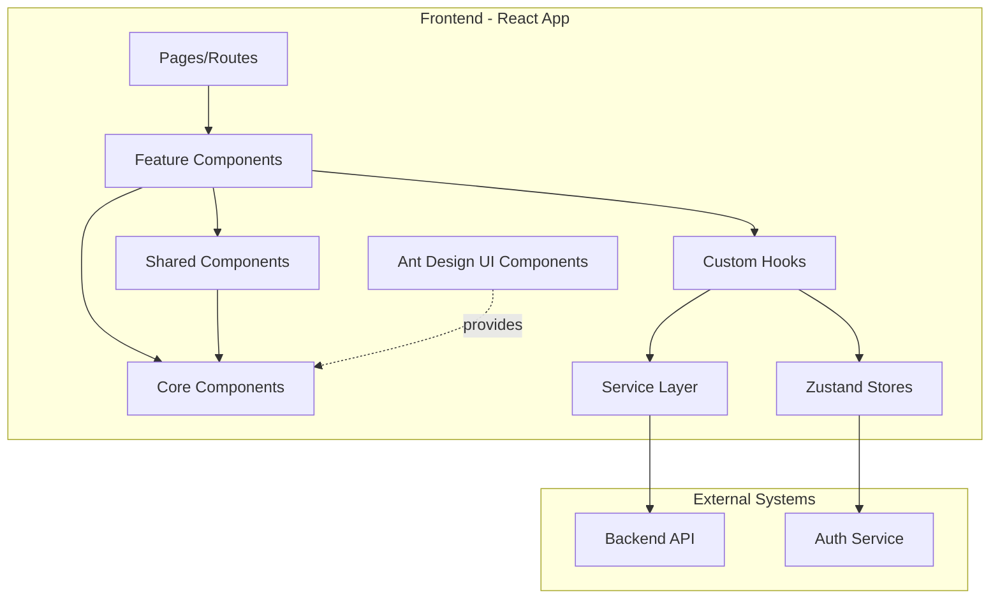
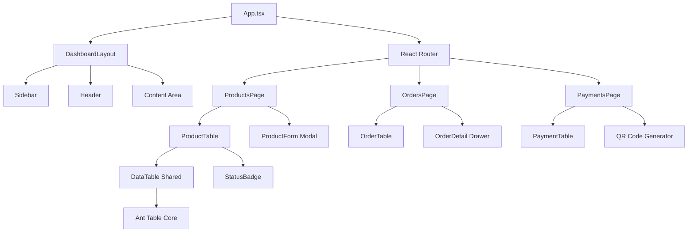
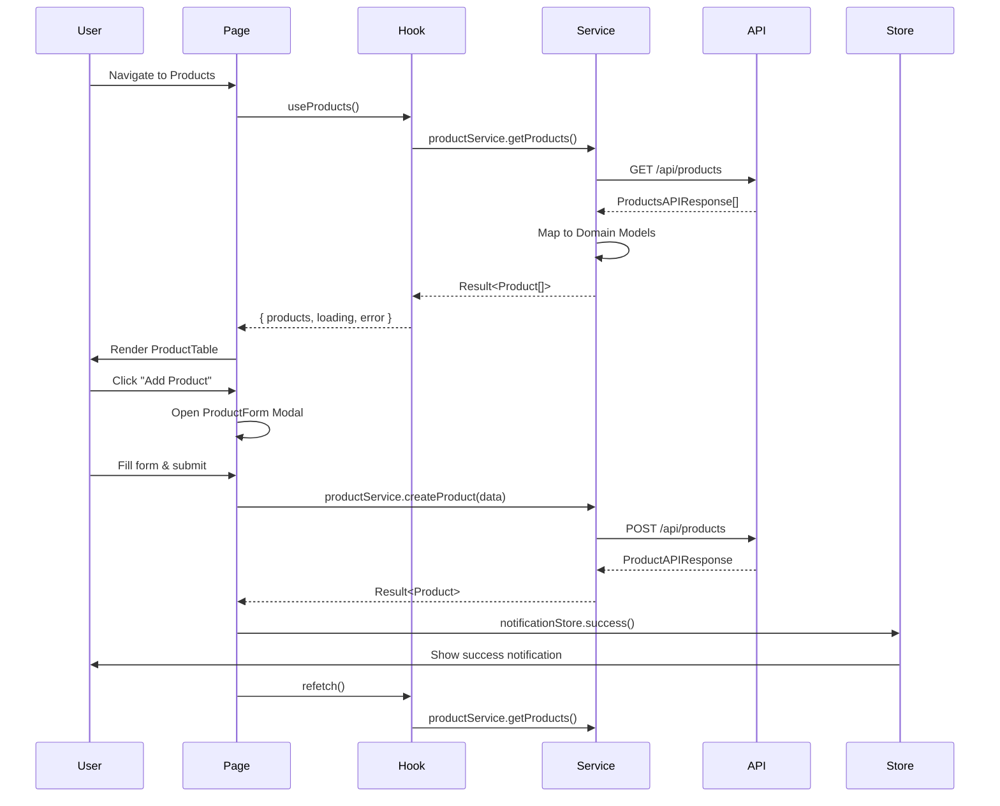
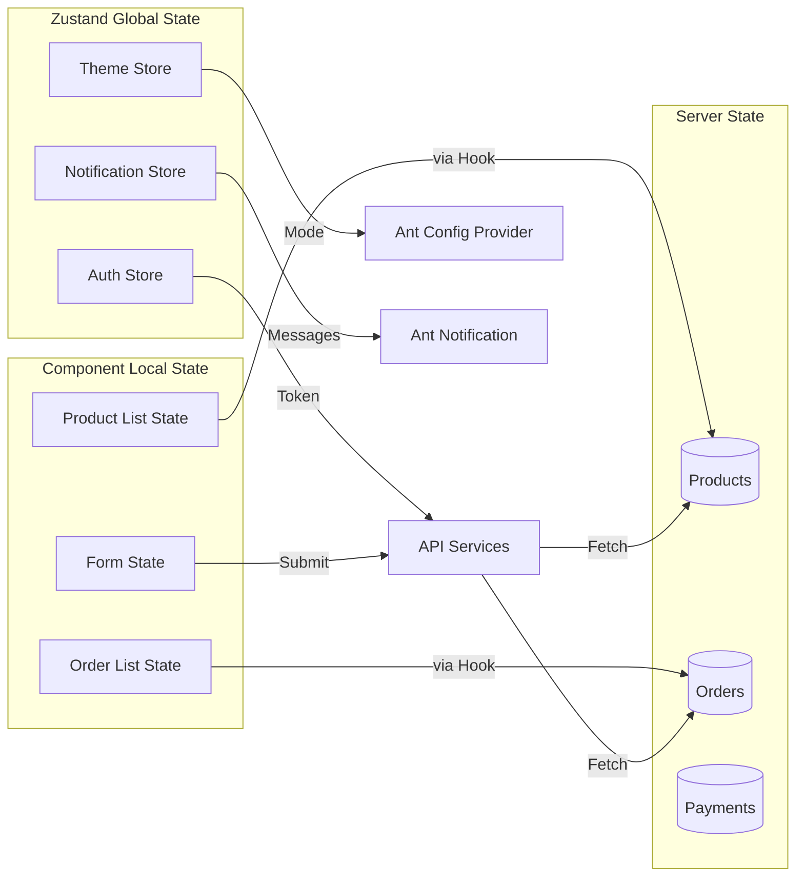
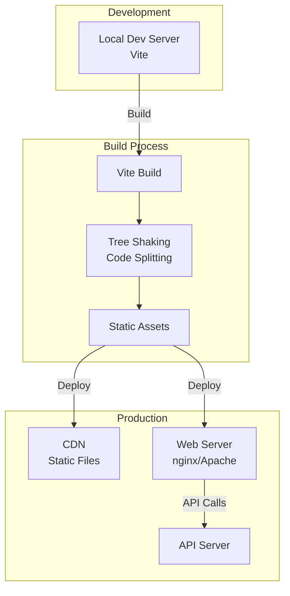
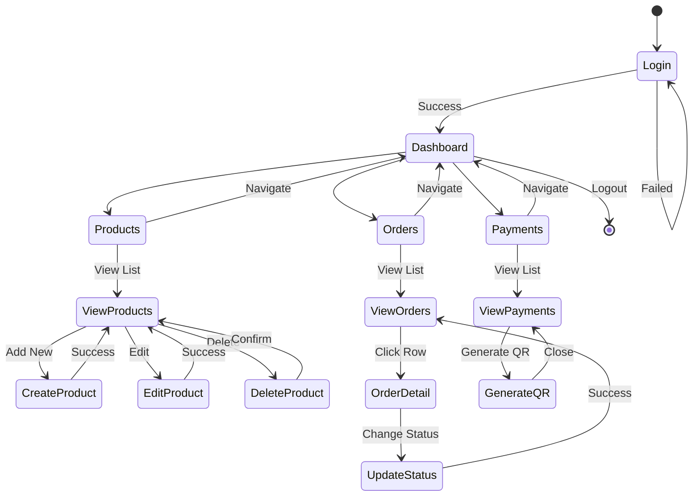
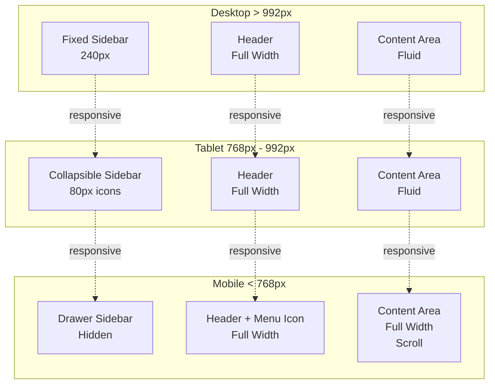

# Feature Specification: Ant Design CMS Frontend

**Feature Branch**: `003-antd-cms-frontend-setup`  
**Created**: December 17, 2025  
**Status**: Draft  
**Input**: Setup Ant Design for CMS with best UI practices

---

## User Scenarios & Testing *(mandatory)*

### User Story 1 - Admin Dashboard Access (Priority: P1)

An administrator needs to access a professional CMS dashboard to manage bakery products, orders, and payments efficiently.

**Why this priority**: Core CMS functionality - without a functional dashboard, no administrative tasks can be performed.

**Independent Test**: Can be fully tested by logging into the system and viewing a responsive, professional dashboard with navigation that delivers immediate value by showing system overview.

**Acceptance Scenarios**:

1. **Given** user is authenticated, **When** they access the dashboard, **Then** they see a professional layout with sidebar navigation, header with user info, and main content area
2. **Given** user is on any page, **When** they resize the browser, **Then** the layout responds appropriately with collapsible sidebar on mobile
3. **Given** user is on the dashboard, **When** they click navigation items, **Then** the corresponding pages load without full page refresh

---

### User Story 2 - Product Management Interface (Priority: P1)

Administrators need to view, create, edit, and delete bakery products through an intuitive interface with data tables.

**Why this priority**: Core business functionality - product management is essential for the bakery CMS.

**Independent Test**: Can be tested by navigating to Products page, viewing the table with filtering/sorting, and performing CRUD operations.

**Acceptance Scenarios**:

1. **Given** admin is on Products page, **When** page loads, **Then** they see a data table with all products, pagination, and action buttons
2. **Given** admin views product table, **When** they click "Add Product", **Then** a modal/drawer opens with a form to create new product
3. **Given** admin is viewing products, **When** they use search or filters, **Then** the table updates to show matching results
4. **Given** admin clicks edit on a product, **When** the form modal opens, **Then** all current product data is pre-filled
5. **Given** admin clicks delete, **When** they confirm the action, **Then** the product is removed and table updates

---

### User Story 3 - Order Management Interface (Priority: P1)

Administrators need to view and manage customer orders with status tracking and detailed information display.

**Why this priority**: Critical for business operations - order management is core to the bakery business.

**Independent Test**: Can be tested by viewing orders table, filtering by status, and viewing order details.

**Acceptance Scenarios**:

1. **Given** admin is on Orders page, **When** page loads, **Then** they see orders table with status badges, customer info, and total amounts
2. **Given** admin views orders, **When** they filter by status (pending/completed/cancelled), **Then** table shows only matching orders
3. **Given** admin clicks on an order, **When** the details view opens, **Then** they see full order information including items, customer, and payment details
4. **Given** admin views order details, **When** they update order status, **Then** the status changes and confirmation is shown

---

### User Story 4 - Payment Processing Interface (Priority: P2)

Administrators need to view payment information, generate QR codes, and track payment status.

**Why this priority**: Important for transaction management but can function with manual payment tracking initially.

**Independent Test**: Can be tested by viewing payments page and generating QR codes for orders.

**Acceptance Scenarios**:

1. **Given** admin is on Payments page, **When** page loads, **Then** they see payment history with status, method, and amounts
2. **Given** admin views an unpaid order, **When** they click "Generate QR", **Then** a QR code is displayed for customer payment
3. **Given** payment is completed, **When** admin refreshes, **Then** payment status updates to completed with timestamp

---

### User Story 5 - Responsive Design & Dark Mode (Priority: P3)

Users need a responsive interface that works on all devices and supports theme customization.

**Why this priority**: Enhances UX but core functionality works without it.

**Independent Test**: Can be tested by accessing the CMS on different screen sizes and toggling theme.

**Acceptance Scenarios**:

1. **Given** user accesses CMS on mobile, **When** they view any page, **Then** layout adapts with collapsed sidebar and touch-friendly controls
2. **Given** user is using the CMS, **When** they toggle dark mode, **Then** entire interface switches to dark theme consistently

---

### Edge Cases

- What happens when the API is slow or unresponsive? (Loading states, error messages)
- How does the system handle very long product names or descriptions? (Text truncation, tooltips)
- What if a user tries to delete a product that's in active orders? (Validation error, confirmation)
- How does pagination work with 1000+ products? (Server-side pagination, virtual scrolling consideration)
- What happens if two admins edit the same product simultaneously? (Optimistic updates, conflict handling)

---

## Requirements *(mandatory)*

### Functional Requirements

- **FR-001**: System MUST provide a professional admin dashboard layout with sidebar navigation and header
- **FR-002**: System MUST implement responsive design that works on desktop, tablet, and mobile devices
- **FR-003**: System MUST provide data tables with sorting, filtering, and pagination for Products, Orders, and Payments
- **FR-004**: System MUST implement CRUD operations through modal forms for Products
- **FR-005**: System MUST display order details with status management capabilities
- **FR-006**: System MUST show loading states during API calls and error messages on failures
- **FR-007**: System MUST provide form validation with clear error messages
- **FR-008**: System MUST implement consistent UI patterns using Ant Design components
- **FR-009**: System MUST support theme customization (light/dark mode)
- **FR-010**: System MUST display notifications for user actions (success, error, info)
- **FR-011**: System MUST maintain the existing functional programming patterns and architecture
- **FR-012**: System MUST use TypeScript for type safety across all components

### Key Entities

- **Product**: Bakery product with name, description, price, category, business type, and status
- **Order**: Customer order with items, total amount, status, customer info, and payment details
- **Payment**: Payment transaction with method, status, amount, and order reference
- **User**: Admin user with authentication and role-based permissions

---

## Data Types

### Type Definitions

```typescript
// ============================================
// CORE ENUMS
// ============================================

export enum ProductStatus {
  ACTIVE = 'active',
  INACTIVE = 'inactive',
  OUT_OF_STOCK = 'out_of_stock',
}

export enum BusinessType {
  B2C = 'b2c',
  B2B = 'b2b',
  BOTH = 'both',
}

export enum OrderStatus {
  PENDING = 'pending',
  CONFIRMED = 'confirmed',
  PREPARING = 'preparing',
  READY = 'ready',
  DELIVERED = 'delivered',
  CANCELLED = 'cancelled',
}

export enum PaymentStatus {
  PENDING = 'pending',
  COMPLETED = 'completed',
  FAILED = 'failed',
  REFUNDED = 'refunded',
}

export enum PaymentMethod {
  CASH = 'cash',
  BANK_TRANSFER = 'bank_transfer',
  E_WALLET = 'e_wallet',
  QR_CODE = 'qr_code',
}

// ============================================
// DOMAIN MODELS
// ============================================

export type Product = {
  id: string;
  name: string;
  description: string;
  price: number;
  category: string;
  businessType: BusinessType;
  status: ProductStatus;
  imageUrl?: string;
  stockQuantity?: number;
  createdAt: Date;
  updatedAt: Date;
};

export type OrderItem = {
  id: string;
  productId: string;
  productName: string;
  quantity: number;
  unitPrice: number;
  subtotal: number;
};

export type Order = {
  id: string;
  orderNumber: string;
  customerName: string;
  customerPhone: string;
  customerEmail?: string;
  items: OrderItem[];
  totalAmount: number;
  status: OrderStatus;
  notes?: string;
  createdAt: Date;
  updatedAt: Date;
};

export type Payment = {
  id: string;
  orderId: string;
  orderNumber: string;
  amount: number;
  method: PaymentMethod;
  status: PaymentStatus;
  qrCodeUrl?: string;
  transactionId?: string;
  paidAt?: Date;
  createdAt: Date;
  updatedAt: Date;
};

// ============================================
// FORM DTOs
// ============================================

export type CreateProductForm = {
  name: string;
  description: string;
  price: number;
  category: string;
  businessType: BusinessType;
  status: ProductStatus;
  imageUrl?: string;
  stockQuantity?: number;
};

export type UpdateProductForm = Partial<CreateProductForm>;

export type CreateOrderForm = {
  customerName: string;
  customerPhone: string;
  customerEmail?: string;
  items: Array<{
    productId: string;
    quantity: number;
  }>;
  notes?: string;
};

export type UpdateOrderStatusForm = {
  status: OrderStatus;
  notes?: string;
};

// ============================================
// TABLE DATA TYPES
// ============================================

export type ProductTableRow = {
  key: string;
  id: string;
  name: string;
  category: string;
  price: number;
  status: ProductStatus;
  businessType: BusinessType;
  stockQuantity?: number;
  updatedAt: Date;
};

export type OrderTableRow = {
  key: string;
  id: string;
  orderNumber: string;
  customerName: string;
  totalAmount: number;
  status: OrderStatus;
  itemCount: number;
  createdAt: Date;
};

export type PaymentTableRow = {
  key: string;
  id: string;
  orderNumber: string;
  amount: number;
  method: PaymentMethod;
  status: PaymentStatus;
  transactionId?: string;
  createdAt: Date;
};

// ============================================
// FILTER & PAGINATION TYPES
// ============================================

export type ProductFilters = {
  search?: string;
  category?: string;
  status?: ProductStatus;
  businessType?: BusinessType;
};

export type OrderFilters = {
  search?: string;
  status?: OrderStatus;
  dateFrom?: Date;
  dateTo?: Date;
};

export type PaymentFilters = {
  search?: string;
  status?: PaymentStatus;
  method?: PaymentMethod;
  dateFrom?: Date;
  dateTo?: Date;
};

export type PaginationParams = {
  page: number;
  pageSize: number;
};

export type PaginatedResponse<T> = {
  data: T[];
  pagination: {
    page: number;
    pageSize: number;
    total: number;
    totalPages: number;
  };
};

// ============================================
// UI STATE TYPES
// ============================================

export type LoadingState = {
  isLoading: boolean;
  error: string | null;
};

export type ModalState = {
  isOpen: boolean;
  mode: 'create' | 'edit' | 'view';
  data?: any;
};

export type ThemeMode = 'light' | 'dark';

export type NotificationType = 'success' | 'error' | 'info' | 'warning';
```

### Validation Schemas

```typescript
import { z } from 'zod';

// Product validation
export const productSchema = z.object({
  name: z.string().min(2, 'Name must be at least 2 characters').max(100),
  description: z.string().min(10, 'Description must be at least 10 characters').max(500),
  price: z.number().positive('Price must be positive').min(0.01),
  category: z.string().min(1, 'Category is required'),
  businessType: z.nativeEnum(BusinessType),
  status: z.nativeEnum(ProductStatus),
  stockQuantity: z.number().int().nonnegative().optional(),
  imageUrl: z.string().url().optional(),
});

// Order validation
export const createOrderSchema = z.object({
  customerName: z.string().min(2, 'Customer name must be at least 2 characters'),
  customerPhone: z.string().regex(/^[0-9]{10,15}$/, 'Invalid phone number'),
  customerEmail: z.string().email('Invalid email').optional(),
  items: z.array(
    z.object({
      productId: z.string().uuid(),
      quantity: z.number().int().positive('Quantity must be positive'),
    })
  ).min(1, 'Order must have at least one item'),
  notes: z.string().max(500).optional(),
});

// Order status update validation
export const updateOrderStatusSchema = z.object({
  status: z.nativeEnum(OrderStatus),
  notes: z.string().max(500).optional(),
});
```

---

## Code Structure

### Directory Structure

```
bakery-cms-web/
├── src/
│   ├── components/
│   │   ├── core/                         # Atomic Ant Design wrapper components
│   │   │   ├── index.ts
│   │   │   ├── AntButton/
│   │   │   │   ├── AntButton.tsx
│   │   │   │   ├── AntButton.types.ts
│   │   │   │   └── AntButton.test.tsx
│   │   │   ├── AntInput/
│   │   │   ├── AntTable/
│   │   │   ├── AntModal/
│   │   │   ├── AntDrawer/
│   │   │   ├── AntForm/
│   │   │   ├── AntCard/
│   │   │   ├── AntTag/
│   │   │   ├── AntBadge/
│   │   │   └── AntNotification/
│   │   │
│   │   ├── shared/                       # Composite reusable components
│   │   │   ├── index.ts
│   │   │   ├── DashboardLayout/
│   │   │   │   ├── DashboardLayout.tsx
│   │   │   │   ├── DashboardLayout.types.ts
│   │   │   │   ├── components/
│   │   │   │   │   ├── Sidebar.tsx
│   │   │   │   │   ├── Header.tsx
│   │   │   │   │   └── Footer.tsx
│   │   │   │   └── DashboardLayout.test.tsx
│   │   │   ├── PageHeader/
│   │   │   ├── DataTable/                # Reusable table with filters
│   │   │   ├── FormModal/                # Reusable modal form wrapper
│   │   │   ├── StatusBadge/              # Status indicator component
│   │   │   ├── PriceDisplay/
│   │   │   ├── EmptyState/
│   │   │   └── ErrorBoundary/
│   │   │
│   │   └── features/                     # Feature-specific components
│   │       ├── products/
│   │       │   ├── ProductList/
│   │       │   │   ├── ProductList.tsx
│   │       │   │   ├── ProductList.types.ts
│   │       │   │   ├── hooks/
│   │       │   │   │   └── useProductList.ts
│   │       │   │   └── ProductList.test.tsx
│   │       │   ├── ProductTable/
│   │       │   ├── ProductForm/
│   │       │   ├── ProductDetail/
│   │       │   └── ProductFilters/
│   │       │
│   │       ├── orders/
│   │       │   ├── OrderList/
│   │       │   ├── OrderTable/
│   │       │   ├── OrderForm/
│   │       │   ├── OrderDetail/
│   │       │   ├── OrderStatusUpdater/
│   │       │   └── OrderFilters/
│   │       │
│   │       └── payments/
│   │           ├── PaymentList/
│   │           ├── PaymentTable/
│   │           ├── PaymentDetail/
│   │           ├── QRCodeGenerator/
│   │           └── PaymentFilters/
│   │
│   ├── pages/
│   │   ├── Dashboard/
│   │   │   └── DashboardPage.tsx
│   │   ├── Products/
│   │   │   ├── ProductsPage.tsx
│   │   │   └── ProductDetailPage.tsx
│   │   ├── Orders/
│   │   │   ├── OrdersPage.tsx
│   │   │   └── OrderDetailPage.tsx
│   │   ├── Payments/
│   │   │   ├── PaymentsPage.tsx
│   │   │   └── PaymentDetailPage.tsx
│   │   └── Auth/
│   │       ├── LoginPage.tsx
│   │       └── RegisterPage.tsx
│   │
│   ├── hooks/
│   │   ├── useProducts.ts
│   │   ├── useOrders.ts
│   │   ├── usePayments.ts
│   │   ├── useNotification.ts
│   │   ├── useModal.ts
│   │   ├── useTable.ts
│   │   └── useTheme.ts
│   │
│   ├── stores/
│   │   ├── index.ts
│   │   ├── authStore.ts
│   │   ├── themeStore.ts
│   │   └── notificationStore.ts
│   │
│   ├── services/
│   │   ├── index.ts
│   │   ├── product.service.ts
│   │   ├── order.service.ts
│   │   ├── payment.service.ts
│   │   └── api/
│   │       └── client.ts
│   │
│   ├── types/
│   │   ├── api/
│   │   │   ├── product.api.ts
│   │   │   ├── order.api.ts
│   │   │   └── payment.api.ts
│   │   ├── models/
│   │   │   ├── product.model.ts
│   │   │   ├── order.model.ts
│   │   │   └── payment.model.ts
│   │   ├── mappers/
│   │   │   ├── product.mapper.ts
│   │   │   ├── order.mapper.ts
│   │   │   └── payment.mapper.ts
│   │   ├── common/
│   │   │   ├── error.types.ts
│   │   │   └── result.types.ts
│   │   └── ui/
│   │       ├── table.types.ts
│   │       ├── form.types.ts
│   │       └── theme.types.ts
│   │
│   ├── utils/
│   │   ├── error-handler.ts
│   │   ├── format.ts
│   │   ├── validation.ts
│   │   └── date.ts
│   │
│   ├── config/
│   │   ├── theme.config.ts
│   │   ├── routes.config.ts
│   │   └── antd.config.ts
│   │
│   ├── styles/
│   │   ├── variables.less
│   │   ├── antd-overrides.less
│   │   └── global.css
│   │
│   ├── App.tsx
│   ├── main.tsx
│   └── vite-env.d.ts
│
├── public/
│   └── assets/
│
├── package.json
├── vite.config.ts
├── tsconfig.json
└── README.md
```

### Layer Responsibilities

**Core Components Layer**
- Wrap Ant Design components with project-specific defaults
- Handle consistent styling and behavior
- No business logic
- Fully reusable across features

**Shared Components Layer**
- Composite components built from core components
- Reusable across multiple features
- Presentational logic only
- Accept data via props, no API calls

**Feature Components Layer**
- Feature-specific business logic
- Data fetching and state management
- Use shared and core components
- Handle user interactions

**Pages Layer**
- Route-level components
- Compose feature components
- Handle page-level state
- Minimal logic, mostly composition

**Hooks Layer**
- Reusable business logic
- Data fetching patterns
- State management
- Side effects handling

**Services Layer**
- API communication
- Data transformation (API → Domain models)
- Error handling
- Pure functions for API calls

---

## Component Specifications

### Component: DashboardLayout

```typescript
// components/shared/DashboardLayout/DashboardLayout.types.ts
export type DashboardLayoutProps = {
  children: React.ReactNode;
  title?: string;
};

// Features:
// - Fixed sidebar with collapsible menu
// - Top header with breadcrumbs, notifications, and user menu
// - Responsive behavior (sidebar collapses on mobile)
// - Theme toggle support
// - Active route highlighting in sidebar
```

**Implementation Notes:**
- Use Ant Design Layout components (Layout, Sider, Header, Content, Footer)
- Menu items dynamically generated from routes configuration
- Breakpoint at 768px for mobile responsiveness
- Persist sidebar collapsed state in localStorage

---

### Component: DataTable

```typescript
// components/shared/DataTable/DataTable.types.ts
export type DataTableProps<T> = {
  columns: ColumnType<T>[];
  data: T[];
  loading: boolean;
  pagination: {
    current: number;
    pageSize: number;
    total: number;
    onChange: (page: number, pageSize: number) => void;
  };
  onRow?: (record: T) => { onClick: () => void };
  rowKey: string | ((record: T) => string);
  actions?: Array<{
    label: string;
    icon?: React.ReactNode;
    onClick: (record: T) => void;
    type?: 'primary' | 'default' | 'danger';
  }>;
};

// Features:
// - Sortable columns
// - Row selection
// - Custom row actions
// - Loading skeleton
// - Empty state handling
// - Responsive table (scroll on mobile)
```

---

### Component: ProductTable

```typescript
// components/features/products/ProductTable/ProductTable.types.ts
export type ProductTableProps = {
  filters: ProductFilters;
  onFiltersChange: (filters: ProductFilters) => void;
  onProductEdit: (product: Product) => void;
  onProductDelete: (productId: string) => void;
  onProductCreate: () => void;
};

// Features:
// - Display products in data table
// - Inline filters (search, category, status, business type)
// - Action buttons (Edit, Delete)
// - "Add Product" button
// - Status badges with colors
// - Price formatting
// - Pagination
```

**Implementation Notes:**
- Uses DataTable component
- Integrates useProducts hook for data fetching
- Shows confirmation modal before delete
- Displays stock quantity with warning if low

---

### Component: ProductForm

```typescript
// components/features/products/ProductForm/ProductForm.types.ts
export type ProductFormProps = {
  product?: Product;
  onSubmit: (data: CreateProductForm | UpdateProductForm) => Promise<void>;
  onCancel: () => void;
  mode: 'create' | 'edit';
};

// Features:
// - Form fields for all product attributes
// - Real-time validation with Zod
// - Field-level error messages
// - Loading state during submission
// - Reset button
// - Image upload preview (optional)
```

**Implementation Notes:**
- Use Ant Design Form component
- Integrate Zod validation schema
- Category dropdown populated from API
- Price input with currency formatting
- Business type and status as radio groups

---

### Component: OrderTable

```typescript
// components/features/orders/OrderTable/OrderTable.types.ts
export type OrderTableProps = {
  filters: OrderFilters;
  onFiltersChange: (filters: OrderFilters) => void;
  onOrderView: (orderId: string) => void;
  onStatusUpdate: (orderId: string, status: OrderStatus) => void;
};

// Features:
// - Display orders with customer info
// - Status badges with workflow colors
// - Date range filters
// - Status filter dropdown
// - Quick status update dropdown
// - Click row to view details
```

**Implementation Notes:**
- Status colors: pending (blue), confirmed (cyan), preparing (orange), ready (green), delivered (success), cancelled (red)
- Date filters use Ant Design DatePicker.RangePicker
- Quick status update shows confirmation for critical statuses

---

### Component: OrderDetail

```typescript
// components/features/orders/OrderDetail/OrderDetail.types.ts
export type OrderDetailProps = {
  orderId: string;
  onStatusUpdate: (status: OrderStatus, notes?: string) => Promise<void>;
  onClose: () => void;
};

// Features:
// - Display full order information in sections
// - Customer information card
// - Order items table with subtotals
// - Payment information
// - Status timeline/history
// - Status update form
// - Print order button
```

**Implementation Notes:**
- Use Ant Design Drawer for detail view
- Sections: Customer Info, Order Items, Payment Details, Status History
- Status update with notes field
- Calculate and display totals

---

### Component: PaymentTable

```typescript
// components/features/payments/PaymentTable/PaymentTable.types.ts
export type PaymentTableProps = {
  filters: PaymentFilters;
  onFiltersChange: (filters: PaymentFilters) => void;
  onPaymentView: (paymentId: string) => void;
  onGenerateQR: (orderId: string) => void;
};

// Features:
// - Display payments with method and status
// - Status filter
// - Payment method filter
// - Generate QR code button for pending payments
// - Transaction ID display
// - Amount formatting with currency
```

---

### Component: QRCodeGenerator

```typescript
// components/features/payments/QRCodeGenerator/QRCodeGenerator.types.ts
export type QRCodeGeneratorProps = {
  orderId: string;
  amount: number;
  onGenerate: (orderId: string) => Promise<string>; // Returns QR URL
  onClose: () => void;
};

// Features:
// - Generate QR code for payment
// - Display QR code image
// - Show payment instructions
// - Copy payment link button
// - Auto-refresh payment status
// - Download QR code button
```

---

### Component: StatusBadge

```typescript
// components/shared/StatusBadge/StatusBadge.types.ts
export type StatusBadgeProps = {
  status: OrderStatus | PaymentStatus | ProductStatus;
  type: 'order' | 'payment' | 'product';
};

// Features:
// - Display status with appropriate color
// - Consistent styling across app
// - Icon support
// - Tooltip with status description
```

**Status Color Mapping:**
```typescript
const orderStatusColors = {
  pending: 'blue',
  confirmed: 'cyan',
  preparing: 'orange',
  ready: 'green',
  delivered: 'success',
  cancelled: 'red',
};

const paymentStatusColors = {
  pending: 'warning',
  completed: 'success',
  failed: 'error',
  refunded: 'default',
};

const productStatusColors = {
  active: 'success',
  inactive: 'default',
  out_of_stock: 'error',
};
```

---

### Component: PageHeader

```typescript
// components/shared/PageHeader/PageHeader.types.ts
export type PageHeaderProps = {
  title: string;
  subtitle?: string;
  breadcrumbs?: Array<{ label: string; path?: string }>;
  actions?: React.ReactNode;
  extra?: React.ReactNode;
};

// Features:
// - Page title and subtitle
// - Breadcrumb navigation
// - Action buttons (aligned right)
// - Extra content area
// - Responsive layout
```

---

## State Management

### Global State (Zustand)

```typescript
// stores/authStore.ts
export type AuthStore = {
  user: User | null;
  token: string | null;
  isAuthenticated: boolean;
  login: (email: string, password: string) => Promise<void>;
  logout: () => void;
  refreshToken: () => Promise<void>;
};

// stores/themeStore.ts
export type ThemeStore = {
  mode: ThemeMode;
  toggleTheme: () => void;
  setTheme: (mode: ThemeMode) => void;
};

// stores/notificationStore.ts
export type NotificationStore = {
  show: (type: NotificationType, message: string, description?: string) => void;
  success: (message: string, description?: string) => void;
  error: (message: string, description?: string) => void;
  warning: (message: string, description?: string) => void;
  info: (message: string, description?: string) => void;
};
```

### Local State Patterns

**Data Fetching Hook Pattern:**
```typescript
export const useProducts = (filters?: ProductFilters) => {
  const [products, setProducts] = useState<Product[]>([]);
  const [loading, setLoading] = useState(false);
  const [error, setError] = useState<string | null>(null);
  const [pagination, setPagination] = useState({
    page: 1,
    pageSize: 10,
    total: 0,
  });

  const fetchProducts = useCallback(async () => {
    setLoading(true);
    setError(null);
    
    const result = await productService.getProducts(filters, pagination);
    
    if (result.success) {
      setProducts(result.data.data);
      setPagination(result.data.pagination);
    } else {
      setError(result.error.message);
    }
    
    setLoading(false);
  }, [filters, pagination.page, pagination.pageSize]);

  useEffect(() => {
    fetchProducts();
  }, [fetchProducts]);

  return {
    products,
    loading,
    error,
    pagination,
    refetch: fetchProducts,
  };
};
```

---

## Routing

### Route Configuration

```typescript
// config/routes.config.ts
export type RouteConfig = {
  path: string;
  title: string;
  icon?: React.ReactNode;
  component: React.ComponentType;
  children?: RouteConfig[];
  requireAuth?: boolean;
  roles?: string[];
};

export const routes: RouteConfig[] = [
  {
    path: '/',
    title: 'Dashboard',
    icon: <DashboardOutlined />,
    component: DashboardPage,
    requireAuth: true,
  },
  {
    path: '/products',
    title: 'Products',
    icon: <ShoppingOutlined />,
    component: ProductsPage,
    requireAuth: true,
    children: [
      {
        path: '/products/:id',
        title: 'Product Detail',
        component: ProductDetailPage,
      },
    ],
  },
  {
    path: '/orders',
    title: 'Orders',
    icon: <FileTextOutlined />,
    component: OrdersPage,
    requireAuth: true,
    children: [
      {
        path: '/orders/:id',
        title: 'Order Detail',
        component: OrderDetailPage,
      },
    ],
  },
  {
    path: '/payments',
    title: 'Payments',
    icon: <CreditCardOutlined />,
    component: PaymentsPage,
    requireAuth: true,
  },
  {
    path: '/auth/login',
    title: 'Login',
    component: LoginPage,
    requireAuth: false,
  },
];
```

### Router Setup

```typescript
// App.tsx
import { ConfigProvider, theme } from 'antd';
import { BrowserRouter, Routes, Route, Navigate } from 'react-router-dom';
import { useThemeStore } from '@/stores/themeStore';
import { DashboardLayout } from '@/components/shared/DashboardLayout';
import { routes } from '@/config/routes.config';

export const App = () => {
  const { mode } = useThemeStore();

  return (
    <ConfigProvider
      theme={{
        algorithm: mode === 'dark' ? theme.darkAlgorithm : theme.defaultAlgorithm,
        token: {
          colorPrimary: '#1890ff',
          borderRadius: 6,
        },
      }}
    >
      <BrowserRouter>
        <Routes>
          <Route path="/auth/*" element={<AuthRoutes />} />
          <Route
            path="/*"
            element={
              <RequireAuth>
                <DashboardLayout>
                  <MainRoutes />
                </DashboardLayout>
              </RequireAuth>
            }
          />
        </Routes>
      </BrowserRouter>
    </ConfigProvider>
  );
};
```

---

## API Integration

### API Client Setup

```typescript
// services/api/client.ts
import axios, { AxiosInstance, AxiosError } from 'axios';
import { notification } from 'antd';

type APIConfig = {
  baseURL: string;
  timeout: number;
};

export const createAPIClient = (config: APIConfig): AxiosInstance => {
  const client = axios.create({
    baseURL: config.baseURL || import.meta.env.VITE_API_URL,
    timeout: config.timeout || 10000,
    headers: {
      'Content-Type': 'application/json',
    },
  });

  // Request interceptor
  client.interceptors.request.use(
    (config) => {
      const token = localStorage.getItem('auth_token');
      if (token) {
        config.headers.Authorization = `Bearer ${token}`;
      }
      return config;
    },
    (error) => Promise.reject(error)
  );

  // Response interceptor
  client.interceptors.response.use(
    (response) => response,
    (error: AxiosError) => {
      if (error.response?.status === 401) {
        // Clear auth and redirect to login
        localStorage.removeItem('auth_token');
        window.location.href = '/auth/login';
      } else if (error.response?.status === 403) {
        notification.error({
          message: 'Access Denied',
          description: 'You do not have permission to perform this action.',
        });
      } else if (error.response?.status >= 500) {
        notification.error({
          message: 'Server Error',
          description: 'An error occurred on the server. Please try again later.',
        });
      }
      return Promise.reject(error);
    }
  );

  return client;
};

export const apiClient = createAPIClient({
  baseURL: import.meta.env.VITE_API_URL,
  timeout: 10000,
});
```

### Service Layer Example

```typescript
// services/product.service.ts
import { apiClient } from './api/client';
import { Result, ok, err } from '@/types/common/result.types';
import { Product, CreateProductForm, UpdateProductForm, ProductFilters, PaginatedResponse } from '@/types/models/product.model';
import { mapProductFromAPI } from '@/types/mappers/product.mapper';
import { handleAPIError } from '@/utils/error-handler';

export const productService = {
  getProducts: async (
    filters?: ProductFilters,
    pagination?: { page: number; pageSize: number }
  ): Promise<Result<PaginatedResponse<Product>>> => {
    try {
      const params = {
        ...filters,
        page: pagination?.page || 1,
        pageSize: pagination?.pageSize || 10,
      };
      
      const response = await apiClient.get('/api/products', { params });
      
      const products = response.data.data.map(mapProductFromAPI);
      
      return ok({
        data: products,
        pagination: response.data.pagination,
      });
    } catch (error) {
      return err(handleAPIError(error));
    }
  },

  getProductById: async (id: string): Promise<Result<Product>> => {
    try {
      const response = await apiClient.get(`/api/products/${id}`);
      return ok(mapProductFromAPI(response.data));
    } catch (error) {
      return err(handleAPIError(error));
    }
  },

  createProduct: async (data: CreateProductForm): Promise<Result<Product>> => {
    try {
      const response = await apiClient.post('/api/products', data);
      return ok(mapProductFromAPI(response.data));
    } catch (error) {
      return err(handleAPIError(error));
    }
  },

  updateProduct: async (id: string, data: UpdateProductForm): Promise<Result<Product>> => {
    try {
      const response = await apiClient.put(`/api/products/${id}`, data);
      return ok(mapProductFromAPI(response.data));
    } catch (error) {
      return err(handleAPIError(error));
    }
  },

  deleteProduct: async (id: string): Promise<Result<void>> => {
    try {
      await apiClient.delete(`/api/products/${id}`);
      return ok(undefined);
    } catch (error) {
      return err(handleAPIError(error));
    }
  },
};
```

---

## Styling & Theming

### Ant Design Theme Configuration

```typescript
// config/theme.config.ts
import type { ThemeConfig } from 'antd';

export const lightTheme: ThemeConfig = {
  token: {
    colorPrimary: '#1890ff',
    colorSuccess: '#52c41a',
    colorWarning: '#faad14',
    colorError: '#f5222d',
    colorInfo: '#1890ff',
    
    fontSize: 14,
    borderRadius: 6,
    
    colorBgContainer: '#ffffff',
    colorBgElevated: '#ffffff',
    colorBorder: '#d9d9d9',
    colorText: '#000000d9',
    colorTextSecondary: '#00000073',
  },
  components: {
    Layout: {
      headerBg: '#001529',
      siderBg: '#001529',
      bodyBg: '#f0f2f5',
    },
    Table: {
      headerBg: '#fafafa',
      rowHoverBg: '#f5f5f5',
    },
    Card: {
      boxShadow: '0 1px 2px 0 rgba(0, 0, 0, 0.03)',
    },
  },
};

export const darkTheme: ThemeConfig = {
  token: {
    colorPrimary: '#1890ff',
    colorSuccess: '#52c41a',
    colorWarning: '#faad14',
    colorError: '#f5222d',
    colorInfo: '#1890ff',
    
    fontSize: 14,
    borderRadius: 6,
    
    colorBgContainer: '#141414',
    colorBgElevated: '#1f1f1f',
    colorBorder: '#434343',
    colorText: '#ffffffd9',
    colorTextSecondary: '#ffffff73',
  },
  components: {
    Layout: {
      headerBg: '#141414',
      siderBg: '#001529',
      bodyBg: '#000000',
    },
  },
};
```

### Custom Styles

```less
// styles/antd-overrides.less
@import '~antd/dist/reset.css';

// Custom sidebar styles
.ant-layout-sider {
  box-shadow: 2px 0 8px rgba(0, 0, 0, 0.15);
  
  .ant-menu-item-selected {
    background-color: #1890ff !important;
  }
}

// Table responsive
.ant-table-wrapper {
  @media (max-width: 768px) {
    .ant-table {
      font-size: 12px;
    }
    
    .ant-table-cell {
      padding: 8px 4px;
    }
  }
}

// Form spacing
.ant-form-item {
  margin-bottom: 16px;
}

// Card hover effect
.ant-card {
  transition: all 0.3s ease;
  
  &:hover {
    box-shadow: 0 4px 12px rgba(0, 0, 0, 0.15);
  }
}
```

### Responsive Design

**Breakpoints:**
- Mobile: < 576px
- Tablet: 576px - 768px
- Desktop: 768px - 992px
- Large Desktop: > 992px

**Responsive Patterns:**
- Sidebar collapses on mobile (< 768px)
- Tables scroll horizontally on mobile
- Forms stack vertically on mobile
- Grid layouts adjust columns based on screen size
- Touch-friendly buttons (min 44x44px on mobile)

---

## Testing Strategy

### Unit Tests

```typescript
// components/core/AntButton/AntButton.test.tsx
import { render, screen, fireEvent } from '@testing-library/react';
import { AntButton } from './AntButton';

describe('AntButton', () => {
  it('renders with children', () => {
    render(<AntButton>Click me</AntButton>);
    expect(screen.getByText('Click me')).toBeInTheDocument();
  });

  it('calls onClick handler when clicked', () => {
    const handleClick = jest.fn();
    render(<AntButton onClick={handleClick}>Click me</AntButton>);
    
    fireEvent.click(screen.getByText('Click me'));
    expect(handleClick).toHaveBeenCalledTimes(1);
  });

  it('applies variant styles', () => {
    render(<AntButton type="primary">Primary</AntButton>);
    expect(screen.getByRole('button')).toHaveClass('ant-btn-primary');
  });
});
```

### Component Tests

```typescript
// components/features/products/ProductTable/ProductTable.test.tsx
import { render, screen, waitFor } from '@testing-library/react';
import userEvent from '@testing-library/user-event';
import { ProductTable } from './ProductTable';

const mockProducts = [
  { id: '1', name: 'Cookie', price: 10, status: 'active' },
  { id: '2', name: 'Cake', price: 20, status: 'inactive' },
];

describe('ProductTable', () => {
  it('displays products in table', () => {
    render(<ProductTable />);
    
    waitFor(() => {
      expect(screen.getByText('Cookie')).toBeInTheDocument();
      expect(screen.getByText('Cake')).toBeInTheDocument();
    });
  });

  it('filters products by search term', async () => {
    const user = userEvent.setup();
    render(<ProductTable />);
    
    const searchInput = screen.getByPlaceholderText('Search products');
    await user.type(searchInput, 'Cookie');
    
    waitFor(() => {
      expect(screen.getByText('Cookie')).toBeInTheDocument();
      expect(screen.queryByText('Cake')).not.toBeInTheDocument();
    });
  });
});
```

### Integration Tests

```typescript
// pages/Products/ProductsPage.integration.test.tsx
import { render, screen, waitFor } from '@testing-library/react';
import userEvent from '@testing-library/user-event';
import { ProductsPage } from './ProductsPage';

describe('ProductsPage Integration', () => {
  it('allows creating a new product', async () => {
    const user = userEvent.setup();
    render(<ProductsPage />);
    
    // Click add product button
    await user.click(screen.getByText('Add Product'));
    
    // Fill form
    await user.type(screen.getByLabelText('Name'), 'New Cookie');
    await user.type(screen.getByLabelText('Price'), '15');
    
    // Submit
    await user.click(screen.getByText('Create'));
    
    // Verify success
    waitFor(() => {
      expect(screen.getByText('Product created successfully')).toBeInTheDocument();
      expect(screen.getByText('New Cookie')).toBeInTheDocument();
    });
  });
});
```

### Coverage Target

- **Unit Tests**: > 80% coverage
- **Component Tests**: > 70% coverage
- **Integration Tests**: Critical user flows
- **E2E Tests**: Main CMS workflows (Cypress/Playwright)

---

## Performance Optimization

### Code Splitting

```typescript
// App.tsx - Route-based code splitting
import { lazy, Suspense } from 'react';
import { Spin } from 'antd';

const ProductsPage = lazy(() => import('@/pages/Products/ProductsPage'));
const OrdersPage = lazy(() => import('@/pages/Orders/OrdersPage'));
const PaymentsPage = lazy(() => import('@/pages/Payments/PaymentsPage'));

export const App = () => (
  <Suspense fallback={<Spin size="large" style={{ margin: '20px auto' }} />}>
    <Routes>
      <Route path="/products" element={<ProductsPage />} />
      <Route path="/orders" element={<OrdersPage />} />
      <Route path="/payments" element={<PaymentsPage />} />
    </Routes>
  </Suspense>
);
```

### Memoization

```typescript
// components/features/products/ProductTable/ProductTable.tsx
import { useMemo, useCallback } from 'react';

export const ProductTable = ({ filters }: ProductTableProps) => {
  const { products, loading } = useProducts(filters);
  
  // Memoize expensive calculations
  const productTableData = useMemo(() => {
    return products.map(product => ({
      key: product.id,
      ...product,
      priceFormatted: formatCurrency(product.price),
    }));
  }, [products]);
  
  // Memoize callbacks
  const handleEdit = useCallback((product: Product) => {
    // Edit logic
  }, []);
  
  return <Table dataSource={productTableData} loading={loading} />;
};
```

### Virtual Scrolling

For large datasets (> 1000 items), use Ant Design's `virtual` prop:

```typescript
<Table
  virtual
  scroll={{ y: 600 }}
  dataSource={largeDataset}
/>
```

### Image Optimization

```typescript
// components/shared/ProductImage/ProductImage.tsx
export const ProductImage = ({ src, alt }: ProductImageProps) => (
  
);
```

### Bundle Size Optimization

```typescript
// vite.config.ts
export default defineConfig({
  build: {
    rollupOptions: {
      output: {
        manualChunks: {
          'vendor-react': ['react', 'react-dom', 'react-router-dom'],
          'vendor-antd': ['antd'],
          'vendor-utils': ['axios', 'zustand'],
        },
      },
    },
  },
});
```

---

## Research & Technology Decisions

### Technology Choice: Ant Design

**Purpose**: Why we need a comprehensive UI component library for the CMS

**Options Considered**:

1. **Ant Design (antd)**
   - **Pros**: 
     - Enterprise-grade UI components
     - Excellent TypeScript support
     - Comprehensive component library (Table, Form, Modal, Layout, etc.)
     - Professional design language
     - Built-in responsive design
     - Active maintenance and community
     - Perfect for admin/CMS interfaces
     - Theme customization support
     - Accessibility compliant
   - **Cons**:
     - Larger bundle size (~500KB minified)
     - Learning curve for customization
     - Opinionated design system

2. **Material-UI (MUI)**
   - **Pros**: Material Design, large community, comprehensive
   - **Cons**: Heavier than antd, different design language, less CMS-focused

3. **Tailwind CSS + Headless UI**
   - **Pros**: Lightweight, highly customizable, utility-first
   - **Cons**: Need to build complex components from scratch, no pre-built Table/Form, longer development time

**Selected**: Ant Design (antd)

**Justification**: 
- Ant Design is specifically designed for enterprise admin interfaces and CMS systems
- Provides all necessary components out-of-the-box (advanced Table with sorting/filtering, complex Forms, Modal/Drawer, Layout system)
- Excellent TypeScript support aligns with project requirements
- Professional appearance suitable for business users
- Built-in responsive design reduces development time
- Theme system allows light/dark mode implementation
- Strong documentation and community support

**Trade-offs**: 
- Accepting larger bundle size in exchange for development speed and feature completeness
- Committing to Ant Design's design language, but allows customization through theme tokens
- Bundle size mitigated through code splitting and tree shaking

**References**:
- [Ant Design Official Documentation](https://ant.design/)
- [Ant Design GitHub](https://github.com/ant-design/ant-design)
- [Ant Design with React Best Practices](https://ant.design/docs/react/introduce)

---

### Technology Choice: Zustand for State Management

**Purpose**: Lightweight global state management for auth, theme, and notifications

**Options Considered**:

1. **Zustand**
   - **Pros**: 
     - Minimal boilerplate
     - Excellent TypeScript support
     - Small bundle size (~1KB)
     - Simple API
     - No context providers needed
   - **Cons**: Less ecosystem than Redux

2. **Redux Toolkit**
   - **Pros**: Industry standard, large ecosystem, dev tools
   - **Cons**: More boilerplate, larger bundle, overkill for this project

3. **React Context API**
   - **Pros**: Built-in, no dependencies
   - **Cons**: Performance issues with frequent updates, verbose

**Selected**: Zustand

**Justification**:
- Minimal boilerplate aligns with functional programming principles
- Small bundle size supports performance goals
- Simple API reduces complexity
- TypeScript support matches project requirements
- Sufficient for auth, theme, and notification state

**Trade-offs**:
- Less mature ecosystem than Redux
- Fewer middleware options
- Less extensive dev tools

**References**:
- [Zustand Documentation](https://github.com/pmndrs/zustand)
- [Zustand vs Redux Comparison](https://github.com/pmndrs/zustand#comparison)

---

### Technology Choice: React Router v6

**Purpose**: Client-side routing for SPA navigation

**Options Considered**:

1. **React Router v6**
   - **Pros**: 
     - Industry standard
     - Declarative routing
     - Nested routes support
     - TypeScript support
     - Data loading capabilities
   - **Cons**: Breaking changes from v5

2. **TanStack Router**
   - **Pros**: Type-safe routing, modern features
   - **Cons**: Newer, smaller community

**Selected**: React Router v6

**Justification**:
- Industry standard with large community
- Already used in project (see existing code)
- Mature and stable
- Excellent documentation
- Nested routes perfect for dashboard layouts

**Trade-offs**: None significant for this use case

**References**:
- [React Router Documentation](https://reactrouter.com/)

---

### Business Solution: CMS Layout Pattern

**Problem**: Need to provide a consistent, professional admin interface that's easy to navigate and works across devices

**Proposed Solution**: 
Implement a standard dashboard layout pattern with:
- Fixed sidebar navigation with collapsible menu
- Top header with breadcrumbs and user menu
- Main content area for pages
- Responsive behavior (sidebar collapse on mobile)
- Persistent theme preference

**Alternatives Considered**:
1. Top navigation only - Less suitable for many menu items
2. Bottom navigation - Not conventional for desktop CMS
3. Hybrid top + side navigation - Too complex for this scope

**Expected Impact**: 
- Improved user experience with familiar CMS pattern
- Reduced learning curve for administrators
- Better organization of features
- Professional appearance increases user confidence

**Risk Assessment**:
- Risk: Users may need training on new interface
- Risk: Mobile usability concerns with complex tables

**Mitigation Strategy**:
- Follow industry-standard patterns users recognize
- Implement responsive design with mobile-optimized views
- Provide tooltips and help text
- User testing before full deployment

---

## Diagrams

### System Architecture Diagram



### Component Hierarchy Diagram



### Data Flow Diagram



### State Management Diagram



### Deployment Architecture



### User Interaction Flow



### Responsive Layout Diagram



---

## Implementation Notes

### Phase 1: Foundation Setup
1. Install Ant Design and dependencies
2. Configure theme and global styles
3. Setup Zustand stores
4. Create core component wrappers
5. Implement DashboardLayout

### Phase 2: Core Features
1. Product management (table, form, CRUD)
2. Order management (table, detail view, status update)
3. Payment management (table, QR generation)

### Phase 3: Enhancement
1. Responsive design refinement
2. Dark mode implementation
3. Performance optimization
4. Error boundary and loading states

### Phase 4: Polish
1. Accessibility improvements
2. Animation and transitions
3. User feedback mechanisms
4. Documentation

---

## Dependencies

```json
{
  "dependencies": {
    "react": "^19.2.0",
    "react-dom": "^19.2.0",
    "react-router-dom": "^6.20.1",
    "antd": "^5.12.0",
    "axios": "^1.6.2",
    "zustand": "^4.4.7",
    "zod": "^3.22.4",
    "@ant-design/icons": "^5.2.6"
  },
  "devDependencies": {
    "@types/react": "^19.2.5",
    "@types/react-dom": "^19.2.3",
    "@vitejs/plugin-react": "^4.3.4",
    "typescript": "~5.9.3",
    "vite": "^5.4.11",
    "vitest": "^1.0.4",
    "@testing-library/react": "^14.1.2",
    "@testing-library/user-event": "^14.5.1",
    "eslint": "^9.39.1",
    "prettier": "^3.1.1"
  }
}
```

---

## Success Criteria

- ✅ Professional CMS interface using Ant Design
- ✅ Responsive design working on all devices
- ✅ All CRUD operations functional for Products, Orders, Payments
- ✅ Form validation with clear error messages
- ✅ Loading and error states properly handled
- ✅ Theme customization (light/dark mode) working
- ✅ TypeScript types for all components and data
- ✅ Follows functional programming patterns from constitution
- ✅ Test coverage > 70%
- ✅ Bundle size optimized with code splitting
- ✅ Accessible UI (WCAG 2.1 Level AA compliance)

---

**End of Specification**
