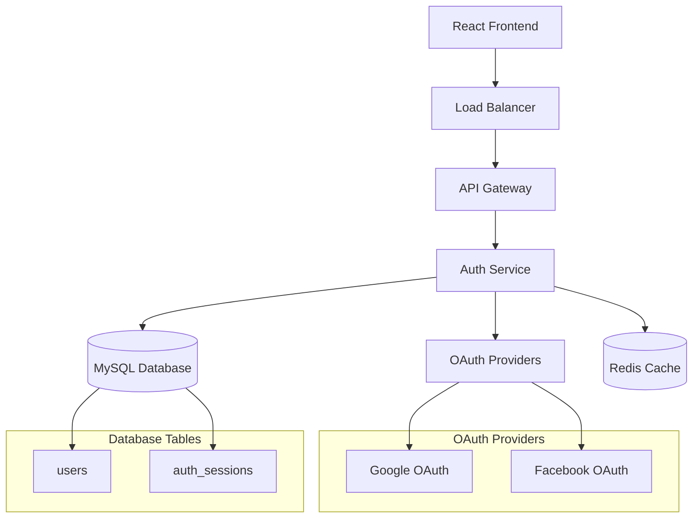
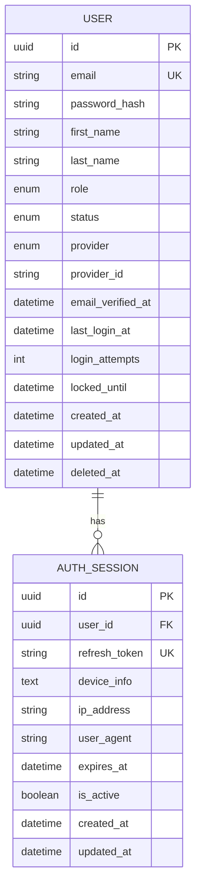
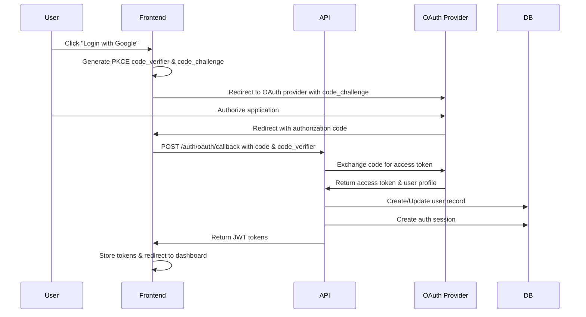
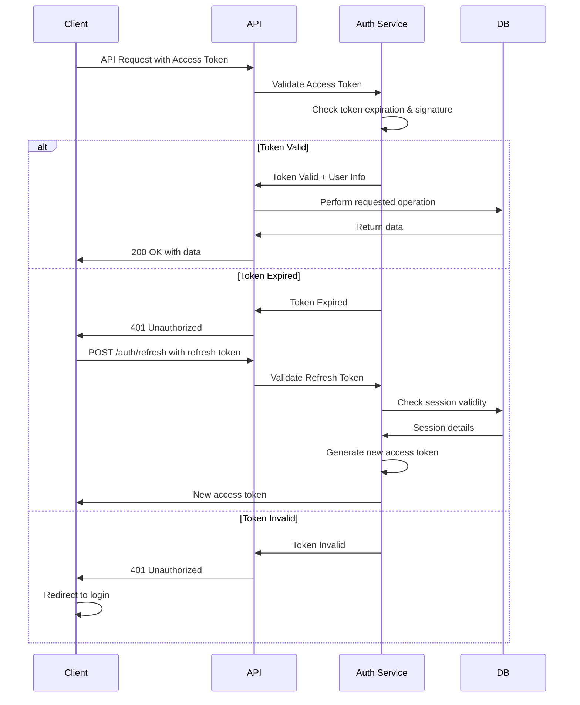
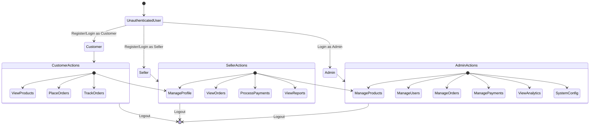
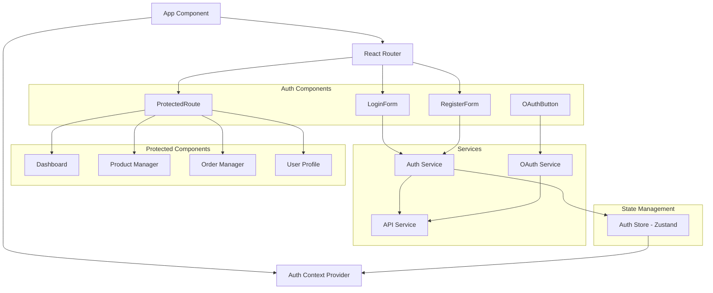

# Feature Specification: Authentication and Authorization

**Feature Branch**: `004-authentication-authorization`  
**Created**: December 17, 2025  
**Status**: Draft  
**Input**: "create feature authentication and authorization include OAuth, seed admin data, token in 365d"

---

## Business Information

### Business Domain
**E-commerce / Point of Sale** - Cookie Sales Management with secure user access control

### Core Business Objectives
- Implement secure user authentication using OAuth 2.0 and traditional login methods
- Establish role-based access control (RBAC) for different user types
- Provide long-term token validity (365 days) for seamless user experience
- Create initial admin user through database seeding
- Ensure secure session management and user state persistence

### Target Users
- **System Administrators**: Full access to all features and user management
- **Shop Owners/Sellers**: Access to product, order, and payment management
- **Customers**: Limited access for order tracking and profile management
- **Third-party Integrations**: OAuth-based access for external applications

### Business Value
- Enhanced security through industry-standard authentication protocols
- Improved user experience with persistent sessions
- Scalable user management for growing business needs
- Compliance with security best practices
- Foundation for future feature access control

### Success Metrics
- Successful OAuth integration with Google and Facebook providers
- Zero authentication-related security vulnerabilities
- Admin user creation and login functionality working
- Token refresh mechanism operating correctly
- 99.9% authentication service uptime
- Average login time under 2 seconds

---

## Business Rules

### BR-001: Multi-Authentication Support
- **Condition**: User login attempts
- **Action**: System MUST support both OAuth (Google, Facebook) and traditional email/password authentication
- **Priority**: Critical
- **Rationale**: Provide flexibility for different user preferences
- **Exceptions**: None

### BR-002: Long-term Token Validity
- **Condition**: Successful authentication
- **Action**: Access tokens MUST have 365-day expiration with automatic refresh capability
- **Priority**: Critical
- **Rationale**: Reduce friction for regular users while maintaining security
- **Exceptions**: Admin users may have shorter token expiry for security

### BR-003: Role-Based Access Control
- **Condition**: All API endpoint access
- **Action**: Users MUST only access resources appropriate to their role level
- **Priority**: Critical
- **Rationale**: Prevent unauthorized access to sensitive business data
- **Exceptions**: Public endpoints (health check, auth endpoints)

### BR-004: Admin User Seeding
- **Condition**: Initial system deployment
- **Action**: System MUST create default admin user with predefined credentials
- **Priority**: High
- **Rationale**: Ensure system accessibility for initial configuration
- **Exceptions**: Only in fresh database deployments

### BR-005: Secure Password Requirements
- **Condition**: Traditional authentication registration/password reset
- **Action**: Passwords MUST meet minimum security requirements (8+ chars, mixed case, numbers, symbols)
- **Priority**: High
- **Rationale**: Prevent brute force attacks and weak password vulnerabilities
- **Exceptions**: None

### BR-006: Session Security
- **Condition**: All authenticated sessions
- **Action**: Sessions MUST use secure, httpOnly cookies with CSRF protection
- **Priority**: Critical
- **Rationale**: Prevent XSS and CSRF attacks
- **Exceptions**: None

### BR-007: OAuth Security Compliance
- **Condition**: Third-party OAuth authentication
- **Action**: MUST implement PKCE (Proof Key for Code Exchange) and state parameter validation
- **Priority**: Critical
- **Rationale**: Prevent authorization code interception attacks
- **Exceptions**: None

### BR-008: Account Lockout Protection
- **Condition**: Multiple failed login attempts
- **Action**: Account MUST be temporarily locked after 5 failed attempts within 15 minutes
- **Priority**: High
- **Rationale**: Prevent brute force attacks
- **Exceptions**: Admin override capability required

---

## Data Type Setup

### Enums
```typescript
enum UserRole {
  ADMIN = 'admin',
  SELLER = 'seller',
  CUSTOMER = 'customer',
  VIEWER = 'viewer'
}

enum AuthProvider {
  LOCAL = 'local',
  GOOGLE = 'google',
  FACEBOOK = 'facebook'
}

enum TokenType {
  ACCESS = 'access',
  REFRESH = 'refresh',
  EMAIL_VERIFICATION = 'email_verification',
  PASSWORD_RESET = 'password_reset'
}

enum UserStatus {
  ACTIVE = 'active',
  INACTIVE = 'inactive',
  SUSPENDED = 'suspended',
  PENDING_VERIFICATION = 'pending_verification'
}
```

### Value Objects
```typescript
interface Email {
  readonly value: string;
  validate(): boolean;
  getDomain(): string;
}

interface HashedPassword {
  readonly hash: string;
  readonly saltRounds: number;
  verify(plainText: string): Promise<boolean>;
}

interface JWTToken {
  readonly token: string;
  readonly expiresAt: Date;
  readonly type: TokenType;
  isExpired(): boolean;
  decode(): TokenPayload;
}
```

### DTOs (Data Transfer Objects)
```typescript
interface RegisterUserDTO {
  readonly email: string;
  readonly password: string;
  readonly firstName: string;
  readonly lastName: string;
  readonly role?: UserRole;
}

interface LoginDTO {
  readonly email: string;
  readonly password: string;
  readonly rememberMe?: boolean;
}

interface OAuthLoginDTO {
  readonly provider: AuthProvider;
  readonly authCode: string;
  readonly state: string;
  readonly codeVerifier: string;
}

interface UserResponseDTO {
  readonly id: string;
  readonly email: string;
  readonly firstName: string;
  readonly lastName: string;
  readonly role: UserRole;
  readonly status: UserStatus;
  readonly createdAt: string;
  readonly lastLoginAt: string | null;
}

interface AuthResponseDTO {
  readonly user: UserResponseDTO;
  readonly accessToken: string;
  readonly refreshToken: string;
  readonly expiresIn: number;
}

interface RefreshTokenDTO {
  readonly refreshToken: string;
}

interface ChangePasswordDTO {
  readonly currentPassword: string;
  readonly newPassword: string;
}
```

### Type Guards
```typescript
function isValidEmail(email: string): boolean {
  const emailRegex = /^[^\s@]+@[^\s@]+\.[^\s@]+$/;
  return emailRegex.test(email);
}

function isValidPassword(password: string): boolean {
  const minLength = 8;
  const hasUpperCase = /[A-Z]/.test(password);
  const hasLowerCase = /[a-z]/.test(password);
  const hasNumbers = /\d/.test(password);
  const hasSpecialChar = /[!@#$%^&*(),.?":{}|<>]/.test(password);
  
  return password.length >= minLength && hasUpperCase && hasLowerCase && hasNumbers && hasSpecialChar;
}

function isValidRole(role: string): role is UserRole {
  return Object.values(UserRole).includes(role as UserRole);
}

function isValidProvider(provider: string): provider is AuthProvider {
  return Object.values(AuthProvider).includes(provider as AuthProvider);
}
```

---

## Code Structure Setup

### Directory Structure
```
bakery-cms-api/
└── packages/
    ├── api/
    │   └── src/
    │       ├── modules/
    │       │   └── auth/
    │       │       ├── controllers/
    │       │       │   ├── auth.controller.ts
    │       │       │   ├── oauth.controller.ts
    │       │       │   └── user.controller.ts
    │       │       ├── services/
    │       │       │   ├── auth.service.ts
    │       │       │   ├── oauth.service.ts
    │       │       │   ├── token.service.ts
    │       │       │   └── user.service.ts
    │       │       ├── repositories/
    │       │       │   ├── user.repository.ts
    │       │       │   └── auth-session.repository.ts
    │       │       ├── middleware/
    │       │       │   ├── auth.middleware.ts
    │       │       │   ├── rbac.middleware.ts
    │       │       │   └── rate-limit.middleware.ts
    │       │       ├── dto/
    │       │       │   ├── auth.dto.ts
    │       │       │   ├── user.dto.ts
    │       │       │   └── oauth.dto.ts
    │       │       ├── validators/
    │       │       │   ├── auth.validator.ts
    │       │       │   └── user.validator.ts
    │       │       ├── utils/
    │       │       │   ├── password.utils.ts
    │       │       │   ├── jwt.utils.ts
    │       │       │   └── oauth.utils.ts
    │       │       └── routes.ts
    │       └── config/
    │           ├── oauth.config.ts
    │           └── jwt.config.ts
    ├── database/
    │   └── src/
    │       ├── models/
    │       │   ├── user.model.ts
    │       │   └── auth-session.model.ts
    │       ├── migrations/
    │       │   ├── 004-create-users-table.ts
    │       │   └── 005-create-auth-sessions-table.ts
    │       └── seeders/
    │           └── admin-user.seeder.ts
    └── common/
        └── src/
            ├── types/
            │   ├── auth.types.ts
            │   └── user.types.ts
            └── constants/
                └── auth.constants.ts

bakery-cms-web/
└── src/
    ├── components/
    │   ├── auth/
    │   │   ├── LoginForm/
    │   │   ├── RegisterForm/
    │   │   ├── OAuthButton/
    │   │   └── ProtectedRoute/
    │   └── user/
    │       ├── UserProfile/
    │       └── ChangePassword/
    ├── pages/
    │   ├── LoginPage.tsx
    │   ├── RegisterPage.tsx
    │   └── ProfilePage.tsx
    ├── services/
    │   ├── auth.service.ts
    │   └── oauth.service.ts
    ├── stores/
    │   └── authStore.ts (extended)
    ├── hooks/
    │   ├── useAuth.ts
    │   └── useOAuth.ts
    └── utils/
        ├── token.utils.ts
        └── auth.utils.ts
```

### Layer Responsibilities
- **Controllers**: Handle HTTP requests, validate input, coordinate service calls
- **Services**: Implement business logic, orchestrate repository operations
- **Repositories**: Data access layer with pure functions
- **Middleware**: Authentication, authorization, rate limiting, validation
- **Utils**: Pure utility functions for password hashing, JWT operations, OAuth flows
- **Validators**: Input validation using functional composition

---

## Data Model

### Entity Definitions
```typescript
// User Entity
@Entity('users')
class User {
  @PrimaryKey()
  @Property({ type: 'uuid', defaultRaw: 'UUID()' })
  id: string;

  @Property({ unique: true, length: 255 })
  email: string;

  @Property({ length: 255, nullable: true })
  passwordHash?: string;

  @Property({ length: 100 })
  firstName: string;

  @Property({ length: 100 })
  lastName: string;

  @Enum(() => UserRole)
  @Index()
  role: UserRole;

  @Enum(() => UserStatus)
  @Index()
  status: UserStatus;

  @Enum(() => AuthProvider)
  provider: AuthProvider;

  @Property({ nullable: true })
  providerId?: string;

  @Property({ type: 'datetime', nullable: true })
  emailVerifiedAt?: Date;

  @Property({ type: 'datetime', nullable: true })
  lastLoginAt?: Date;

  @Property({ type: 'int', default: 0 })
  loginAttempts: number;

  @Property({ type: 'datetime', nullable: true })
  lockedUntil?: Date;

  @Property({ type: 'datetime', defaultRaw: 'NOW()' })
  createdAt: Date;

  @Property({ type: 'datetime', defaultRaw: 'NOW() ON UPDATE NOW()' })
  updatedAt: Date;

  @Property({ type: 'datetime', nullable: true })
  deletedAt?: Date;

  // Virtual properties
  get fullName(): string {
    return `${this.firstName} ${this.lastName}`;
  }

  get isLocked(): boolean {
    return this.lockedUntil !== null && this.lockedUntil > new Date();
  }

  get isEmailVerified(): boolean {
    return this.emailVerifiedAt !== null;
  }
}

// Auth Session Entity
@Entity('auth_sessions')
class AuthSession {
  @PrimaryKey()
  @Property({ type: 'uuid', defaultRaw: 'UUID()' })
  id: string;

  @ManyToOne(() => User)
  @Index()
  user: User;

  @Property({ length: 1000 })
  refreshToken: string;

  @Property({ type: 'text', nullable: true })
  deviceInfo?: string;

  @Property({ length: 45, nullable: true })
  ipAddress?: string;

  @Property({ length: 500, nullable: true })
  userAgent?: string;

  @Property({ type: 'datetime' })
  expiresAt: Date;

  @Property({ type: 'boolean', default: true })
  isActive: boolean;

  @Property({ type: 'datetime', defaultRaw: 'NOW()' })
  createdAt: Date;

  @Property({ type: 'datetime', defaultRaw: 'NOW() ON UPDATE NOW()' })
  updatedAt: Date;

  // Virtual properties
  get isExpired(): boolean {
    return this.expiresAt < new Date();
  }

  get isValid(): boolean {
    return this.isActive && !this.isExpired;
  }
}
```

### Relationships
- User (1) -> (*) AuthSession
- User -> User (self-referential for created_by/updated_by audit trails)

### Indexes
- `users.email` - Unique index for fast email lookups
- `users.role, users.status` - Composite index for access control queries
- `users.provider, users.provider_id` - Composite index for OAuth lookups
- `auth_sessions.user_id, auth_sessions.is_active` - Composite index for active sessions
- `auth_sessions.refresh_token` - Index for token validation
- `auth_sessions.expires_at` - Index for cleanup operations

### Constraints
- Email must be unique across all users
- Provider + ProviderId combination must be unique for OAuth users
- Refresh tokens must be unique
- Password hash required only for local authentication provider
- Soft delete enabled for Users (deletedAt field)

---

## Infrastructure Setup

### Database Configuration
**Extensions to existing MySQL setup:**
- Add support for UUID generation functions
- Configure appropriate indexes for authentication queries
- Set up regular cleanup jobs for expired sessions

### OAuth Configuration
```typescript
// packages/api/src/config/oauth.config.ts
interface OAuthConfig {
  readonly google: {
    readonly clientId: string;
    readonly clientSecret: string;
    readonly redirectUri: string;
    readonly scope: string[];
  };
  readonly facebook: {
    readonly clientId: string;
    readonly clientSecret: string;
    readonly redirectUri: string;
    readonly scope: string[];
  };
}

export const getOAuthConfig = (): OAuthConfig => ({
  google: {
    clientId: process.env['GOOGLE_CLIENT_ID']!,
    clientSecret: process.env['GOOGLE_CLIENT_SECRET']!,
    redirectUri: process.env['GOOGLE_REDIRECT_URI']!,
    scope: ['openid', 'profile', 'email'],
  },
  facebook: {
    clientId: process.env['FACEBOOK_CLIENT_ID']!,
    clientSecret: process.env['FACEBOOK_CLIENT_SECRET']!,
    redirectUri: process.env['FACEBOOK_REDIRECT_URI']!,
    scope: ['email', 'public_profile'],
  },
});
```

### JWT Configuration
```typescript
// packages/api/src/config/jwt.config.ts
interface JWTConfig {
  readonly accessToken: {
    readonly secret: string;
    readonly expiresIn: string;
    readonly algorithm: 'HS256';
  };
  readonly refreshToken: {
    readonly secret: string;
    readonly expiresIn: string;
  };
}

export const getJWTConfig = (): JWTConfig => ({
  accessToken: {
    secret: process.env['JWT_ACCESS_SECRET']!,
    expiresIn: '365d', // 365 days as requested
    algorithm: 'HS256',
  },
  refreshToken: {
    secret: process.env['JWT_REFRESH_SECRET']!,
    expiresIn: '730d', // 2 years for refresh tokens
  },
});
```

### Security Configuration
**Password Hashing:**
```typescript
import bcrypt from 'bcrypt';

const SALT_ROUNDS = 12; // Higher than minimum for extra security

export const hashPassword = async (password: string): Promise<string> => {
  return bcrypt.hash(password, SALT_ROUNDS);
};

export const verifyPassword = async (password: string, hash: string): Promise<boolean> => {
  return bcrypt.compare(password, hash);
};
```

**Rate Limiting:**
- Authentication endpoints: 5 requests per 15 minutes per IP
- OAuth endpoints: 10 requests per 15 minutes per IP  
- General API endpoints: 100 requests per 15 minutes per authenticated user

**CORS Configuration:**
```typescript
const corsOptions = {
  origin: process.env['ALLOWED_ORIGINS']?.split(',') || ['http://localhost:3000'],
  credentials: true,
  optionsSuccessStatus: 200,
  methods: ['GET', 'POST', 'PUT', 'DELETE', 'OPTIONS'],
  allowedHeaders: ['Content-Type', 'Authorization', 'X-Requested-With'],
};
```

### Session Storage
- **Development**: In-memory storage with Redis fallback
- **Production**: Redis cluster for session persistence
- **Session TTL**: 365 days for access tokens, 730 days for refresh tokens
- **Cleanup**: Automated job to remove expired sessions every 24 hours

---

## Diagrams

### System Architecture Diagram


### Database ER Diagram


### OAuth Authentication Flow


### JWT Token Flow


### Role-Based Access Control Flow


### Component Architecture (Frontend)


---

## Research & Technology Decisions

### Technology Choice: OAuth 2.0 with PKCE
- **Purpose**: Secure third-party authentication for web and mobile applications
- **Options Considered**:
  1. OAuth 2.0 with PKCE - Industry standard with enhanced security
  2. SAML 2.0 - Enterprise-focused, overly complex for our use case
  3. OpenID Connect - Builds on OAuth 2.0, good but simpler OAuth sufficient
- **Selected**: OAuth 2.0 with PKCE (Proof Key for Code Exchange)
- **Justification**: 
  - PKCE prevents authorization code interception attacks
  - Supported by major providers (Google, Facebook)
  - Simpler than full OpenID Connect for our current needs
  - Better security than basic OAuth 2.0
- **Trade-offs**: More complex implementation than basic OAuth
- **References**: [RFC 7636](https://tools.ietf.org/html/rfc7636), [OAuth 2.0 Security Best Practices](https://datatracker.ietf.org/doc/html/draft-ietf-oauth-security-topics)

### Technology Choice: JWT with 365-day Expiration
- **Purpose**: Stateless authentication tokens with long-term validity
- **Options Considered**:
  1. Short-lived JWT (15min) + Refresh Token - More secure but complex UX
  2. Session-based authentication - Stateful, doesn't scale well
  3. Long-lived JWT (365d) + Refresh Token - Balanced approach
- **Selected**: Long-lived JWT (365 days) with refresh token mechanism
- **Justification**:
  - Meets business requirement for 365-day validity
  - Refresh token allows revocation when needed
  - Reduces authentication friction for users
  - Stateless scaling benefits
- **Trade-offs**: 
  - Longer attack window if token compromised
  - Requires careful refresh token management
- **Mitigation Strategy**: 
  - Secure refresh token storage
  - Regular session cleanup
  - Token rotation on refresh
- **References**: [JWT Best Practices](https://datatracker.ietf.org/doc/html/rfc8725)

### Technology Choice: bcrypt with 12 Salt Rounds
- **Purpose**: Secure password hashing for local authentication
- **Options Considered**:
  1. bcrypt (12 rounds) - Proven, adjustable difficulty
  2. Argon2 - Modern, memory-hard function
  3. scrypt - Good but less widely adopted
- **Selected**: bcrypt with 12 salt rounds
- **Justification**:
  - Mature and battle-tested algorithm
  - Good performance characteristics
  - 12 rounds provide strong security without excessive CPU cost
  - Wide ecosystem support
- **Trade-offs**: Not the newest algorithm, but reliability trumps novelty
- **References**: [OWASP Password Storage Guidelines](https://cheatsheetseries.owasp.org/cheatsheets/Password_Storage_Cheat_Sheet.html)

### Technology Choice: Redis for Session Storage
- **Purpose**: Fast, persistent session storage for authentication state
- **Options Considered**:
  1. In-memory storage - Fast but not persistent
  2. Database storage - Persistent but slower
  3. Redis - Fast and persistent with TTL support
- **Selected**: Redis with automatic TTL management
- **Justification**:
  - Sub-millisecond session lookup performance
  - Built-in TTL for automatic cleanup
  - High availability clustering support
  - Perfect fit for session data pattern
- **Trade-offs**: Additional infrastructure dependency
- **References**: [Redis Session Store Patterns](https://redis.io/docs/manual/patterns/)

### Business Solution: Admin User Seeding Strategy
- **Problem**: Initial system access requires admin user creation
- **Proposed Solution**: Database seeder with environment-configured admin credentials
- **Alternatives Considered**:
  - Manual admin creation via CLI tool
  - First-user-becomes-admin approach
  - Fixed hardcoded admin credentials
- **Expected Impact**: Seamless deployment process with immediate system access
- **Risk Assessment**: 
  - Potential security risk if default credentials not changed
  - Seeder might fail if admin already exists
- **Mitigation Strategy**:
  - Force password change on first login
  - Idempotent seeder that checks for existing admin
  - Clear documentation on credential change requirement
  - Environment-based configuration for different deployment environments

### Business Solution: Progressive Role Implementation
- **Problem**: Complex RBAC system might delay initial feature delivery
- **Proposed Solution**: Implement roles progressively (Admin → Seller → Customer)
- **Alternatives Considered**:
  - Full RBAC implementation at once
  - Simple admin/user binary system
- **Expected Impact**: Faster initial delivery with clear expansion path
- **Risk Assessment**: Potential technical debt if not properly architected
- **Mitigation Strategy**: Design complete permission system upfront, implement incrementally